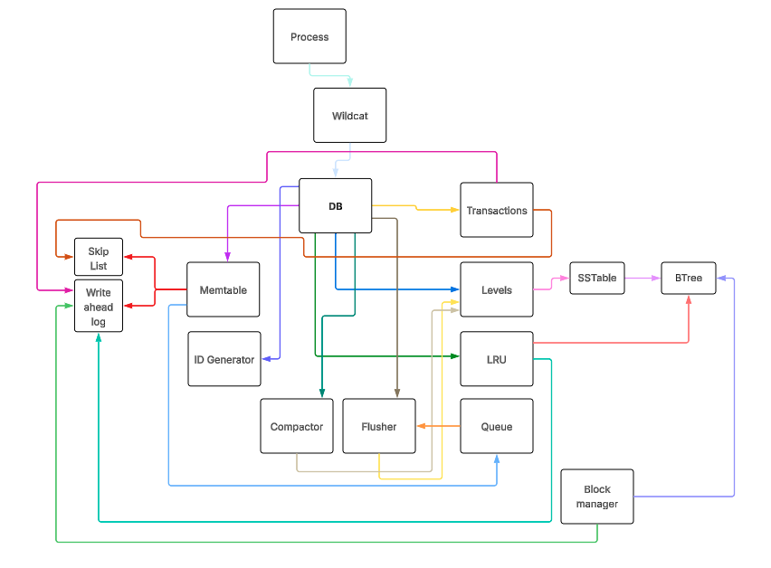

<div>
    <h1 align="left"></h1>
</div>


Wildcat is a high-performance embedded key-value database (or storage engine) written in Go. It incorporates modern database design principles including LSM (Log-Structured Merge) tree architecture, MVCC (Multi-Version Concurrency Control), and lock-free data structures for its critical paths, along with automatic background operations to deliver excellent read/write performance with strong consistency guarantees.

## Features
- LSM (Log-Structured Merge) tree architecture optimized for write and read throughput
- Lock-free MVCC ensures non-blocking reads and writes
- WAL logging captures full transaction state for recovery and rehydration
- Version-aware skip list for fast in-memory MVCC access
- Atomic write path, safe for multithreaded use
- Scalable design with background flusher and compactor
- Durable and concurrent and atomic block storage, leveraging direct, offset-based file I/O (using `pread`/`pwrite`) for optimal performance and control
- Atomic LRU for active block manager handles
- Memtable lifecycle management and snapshot durability
- SSTables are immutable BTree's
- Configurable Sync options such as `None`, `Partial (with background interval)`, `Full`
- Snapshot-isolated MVCC with read timestamps
- Crash recovery restores all in-flight and committed transactions
- Automatic multi-threaded background compaction
- Full ACID transaction support
- Range, prefix, and full iteration support with bidirectional traversal
- Sustains 100K+ txns/sec writes, and hundreds of thousands of reads/sec
- Optional Bloom filter per SSTable for fast key lookups
- Key value separation optimization (`.klog` for keys, `.vlog` for values, klog entries point to vlog entries)
- Tombstone-aware compaction with retention based on active transaction windows
- Transaction recovery with incomplete transactions are preserved and accessible after crashes
- Keys and values are opaque sequences of bytes

## Overview
<div>
    <h1 align="left"></h1>
</div>

## Discord Community
Join our Discord community to discuss, ask questions, and get help with Wildcat.

[](https://discord.gg/Rs5Z2e69ts)

## Table of Contents
- [Version and Compatibility](#version-and-compatibility)
- [Basic Usage](#basic-usage)
  - [Opening a Wildcat DB instance](#opening-a-wildcat-db-instance)
  - [Directory Structure](#directory-structure)
  - [Temporary files](#temporary-files)
  - [Advanced Configuration](#advanced-configuration)
  - [Simple Key-Value Operations](#simple-key-value-operations)
  - [Manual Transaction Management](#manual-transaction-management)
  - [Iterating Keys](#iterating-keys)
    - [Full Iterator (bidirectional)](#full-iterator-bidirectional)
    - [Range Iterator (bidirectional)](#range-iterator-bidirectional)
    - [Prefix Iterator (bidirectional)](#prefix-iterator-bidirectional)
  - [Read-Only Transactions with View](#read-only-transactions-with-view)
  - [Batch Operations](#batch-operations)
  - [Transaction Recovery](#transaction-recovery)
  - [Log Channel](#log-channel)
  - [Database Statistics](#database-statistics)
  - [Force Flushing](#force-flushing)
  - [Escalate Sync](#escalate-sync)
- [Shared C Library](#shared-c-library)
- [Overview](#overview)
    - [MVCC Model](#mvcc-model)
    - [WAL and Durability](#wal-and-durability)
    - [Memtable Lifecycle](#memtable-lifecycle)
    - [SSTables and Compaction](#sstables-and-compaction)
    - [SSTable Metadata](#sstable-metadata)
    - [SSTable Format](#sstable-format)
    - [Compaction Policy / Strategy](#compaction-policy--strategy)
    - [Concurrency Model](#concurrency-model)
    - [Isolation Levels](#isolation-levels)
    - [Recoverability Guarantee Order](#recoverability-guarantee-order)
    - [Block Manager](#block-manager)
    - [LRU Cache](#lru-cache)
    - [Lock-Free Queue](#lock-free-queue)
    - [BTree](#btree)
    - [SkipList](#skiplist)
    - [ID Generator System Integration](#id-generator-system-integration)
    - [Bloom Filter](#bloom-filter)
    - [Merge Iterator](#merge-iterator)
- [Motivation](#motivation)
- [Contributing](#contributing)

## Version and Compatibility
- Go 1.24+
- Linux/macOS/Windows (64-bit)

## Basic Usage
Wildcat supports opening multiple `*wildcat.DB` instances in parallel, each operating independently in separate directories.

### Import
```go
import (
    "github.com/wildcatdb/wildcat"
)
```

### Opening a Wildcat DB instance
The only required option is the database directory path.
```go
// Create default options
opts := &wildcat.Options{
Directory: "/path/to/db",
    // You don't need to set all options only Directory is required!
}

// Open or create a new Wildcat DB instance
db, err := wildcat.Open(opts) // Returns *wildcat.DB
if err != nil {
    // Handle error
}
defer db.Close()
```

### Directory Structure
When you open a Wildcat instance at a configured directory your structure will look like this initially based on configured levels.
By default Wildcat uses 6 levels, so you will see directories like this:
```
/path/to/db/
├── l1
├── l2
├── l3
├── l4
├── l5
├── l6
1.wal
idgstate
```
The `L1`, `L2`, etc. directories are used for storing SSTables(immutable btrees) at different levels of the LSM tree. The `1.wal` file is the **current** Write-Ahead Log (WAL) file tied to the **current** memtable.
When a memtable reaches a configured write buffer size, it is enqueued for flushing to disk and becomes immutable. The WAL file is then rotated, and a new one is created for subsequent writes.

Mind you there can be many WAL files pending flush, and they will be named `2.wal`, `3.wal`, etc. as they are created. The WAL files are used to ensure durability and recoverability of transactions.

When the flusher completes a flush operation an immutable memtable becomes an sstable at L1.

The idgstate file holds sstable, wal, and txn id state.  So when a restart occurs we can recover last known id's and continue monotonically increasing id's for SSTables, WALs, and transactions.

### Temporary files
You may see `.tmp` files within level directories.  These are temporary block manager files which are renamed after finalization of a flusher or compactor process.  On start up of a crash say we don't want to persist partial files so their removed based on that extension.  Partial files can cause inconsistencies in the database and unnecessary disk space.

```
l1/sst_343.klog.tmp > l1/sst_343.klog (once finalized)
l1/sst_343.vlog.tmp > l1/sst_343.klog (once finalized)
```

### Advanced Configuration
Wildcat provides several configuration options for fine-tuning.
```go
opts := &wildcat.Options{
    Directory:                   "/path/to/database",     // Directory for database files
    WriteBufferSize:             64 * 1024 * 1024,        // 64MB memtable size
    SyncOption:                  wildcat.SyncFull,        // Full sync for maximum durability
    SyncInterval:                128 * time.Millisecond,  // Only set when using SyncPartial
    LevelCount:                  7,                       // Number of LSM levels
    LevelMultiplier:             10,                      // Size multiplier between levels
    BlockManagerLRUSize:         256,                     // Cache size for block managers
    SSTableBTreeOrder:           10,                      // BTree order for SSTable klog
    LogChannel:                  make(chan string, 1000), // Channel for real time logging
    BloomFilter:                 false,                   // Enable/disable sstable bloom filters
    MaxCompactionConcurrency:    4,                       // Maximum concurrent compactions
    CompactionCooldownPeriod:    5 * time.Second,         // Cooldown between compactions
    CompactionBatchSize:         8,                       // Max SSTables per compaction
    CompactionSizeRatio:         1.1,                     // Level size ratio trigger
    CompactionSizeThreshold:     8,                       // File count trigger
    CompactionScoreSizeWeight:   0.8,                     // Weight for size-based scoring
    CompactionScoreCountWeight:  0.2,                     // Weight for count-based scoring
    CompactionSizeTieredSimilarityRatio: 1.5,             // Similarity ratio for size-tiered compaction
    FlusherTickerInterval:       1 * time.Millisecond,    // Flusher check interval
    CompactorTickerInterval:     250 * time.Millisecond,  // Compactor check interval
    BloomFilterFPR:              0.01,                    // Bloom filter false positive rate
    WalAppendRetry:              10,                      // WAL append retry count
    WalAppendBackoff:            128 * time.Microsecond,  // WAL append retry backoff
    BlockManagerLRUEvictRatio:   0.20,                    // LRU eviction ratio
    BlockManagerLRUAccesWeight:  0.8,                     // LRU access weight
    STDOutLogging: false,                                 // Log to stdout instead of channel
}
```

#### Configuration Options Explained
1. **Directory** The path where the database files will be stored
2. **WriteBufferSize** Size threshold for memtable before flushing to disk
3. **SyncOption** Controls durability vs performance tradeoff
    - **SyncNone** Fastest, but no durability guarantees
    - **SyncPartial** Balances performance and durability
    - **SyncFull** Maximum durability, slower performance
4. **SyncInterval** Time between background sync operations (only for SyncPartial)
5. **LevelCount** Number of levels in the LSM tree
6. **LevelMultiplier** Size ratio between adjacent levels
7. **BlockManagerLRUSize** Number of block managers to cache
8. **SSTableBTreeOrder** Size of SSTable klog block sets
9. **LogChannel** Channel for real-time logging, useful for debugging and monitoring
10. **BloomFilter** Enable or disable bloom filters for SSTables to speed up key lookups. Bloom filters use double hashing with FNV-1a and FNV hash functions.  Is automatically sized based on expected items and desired false positive rate.
11. **MaxCompactionConcurrency** Maximum number of concurrent compactions
12. **CompactionCooldownPeriod** Cooldown period between compactions to prevent thrashing
13. **CompactionBatchSize** Max number of SSTables to compact at once
14. **CompactionSizeRatio** Level size ratio that triggers compaction
15. **CompactionSizeThreshold** Number of files to trigger size-tiered compaction
16. **CompactionScoreSizeWeight** Weight for size-based compaction scoring
17. **CompactionScoreCountWeight** Weight for count-based compaction scoring
18. **FlusherTickerInterval** Interval for flusher background process
19. **CompactorTickerInterval** Interval for compactor background process
20. **BloomFilterFPR** False positive rate for Bloom filters
21. **WalAppendRetry** Number of retries for WAL append operations
22. **WalAppendBackoff** Backoff duration for WAL append retries
23. **BlockManagerLRUEvictRatio** Ratio for LRU eviction. Determines what percentage of the cache to evict when cleanup is needed.
24. **BlockManagerLRUAccesWeight** Weight for LRU access eviction. Balances how much to prioritize access frequency vs. age when deciding what to evict.
25. **STDOutLogging** If true, logs will be printed to stdout instead of the log channel.  Log channel will be ignored if provided.
25. **CompactionSizeTieredSimilarityRatio**  Similarity ratio for size-tiered compaction.  For grouping SSTables that are "roughly the same size" together for compaction.

### Simple Key-Value Operations
The easiest way to interact with Wildcat is through the Update method, which handles transactions automatically.  This means it runs begin, commit, and rollback for you, allowing you to focus on the operations themselves.
```go
// Write a value
err := db.Update(func(txn *wildcat.Txn) error {
    return txn.Put([]byte("hello"), []byte("world"))
})
if err != nil {
    // Handle error
}

// Read a value
var result []byte
err = db.View(func(txn *wildcat.Txn) error {
    var err error
    result, err = txn.Get([]byte("hello"))
    return err
})

if err != nil {
    // Handle error
} else {
    fmt.Println("Value:", string(result)) // Outputs: Value: world
}
```

### Manual Transaction Management
For more complex operations, you can manually manage transactions.
```go
// Begin a transaction
txn := db.Begin()

// Perform operations
err := txn.Put([]byte("key1"), []byte("value1"))
if err != nil {
    txn.Rollback()
    // Handle error
}

value, err := txn.Get([]byte("key1"))
if err != nil {
    txn.Rollback()
    // Handle error
}

// Commit or rollback
err = txn.Commit()
if err != nil {
    txn.Rollback()
    // Handle commit error
}
```

### Iterating Keys
Wildcat provides comprehensive iteration capabilities with MVCC consistency.

> [!TIP]
> You can set ascending or descending order, and iterate over all keys, a range of keys, or keys with a specific prefix.

#### Full Iterator (bidirectional)
```go
err := db.View(func(txn *wildcat.Txn) error {
    // Create ascending iterator
    iter, err := txn.NewIterator(true)
    if err != nil {
        return err
    }

    // Iterate forward
    for {
        key, value, timestamp, ok := iter.Next()
        if !ok {
            break
        }

        fmt.Printf("Key: %s, Value: %s, Timestamp: %d\n", key, value, timestamp)
    }

    // Change direction and iterate backward
    err = iter.SetDirection(false)
    if err != nil {
        return err
    }

    for {
        key, value, timestamp, ok := iter.Next()
        if !ok {
            break
        }

        fmt.Printf("Key: %s, Value: %s, Timestamp: %d\n", key, value, timestamp)
    }

    return nil
})
```

#### Range Iterator (bidirectional)
```go
err := db.View(func(txn *wildcat.Txn) error {
    // Create range iterator
    iter, err := txn.NewRangeIterator([]byte("start"), []byte("end"), true)
    if err != nil {
        return err
    }

    // Iterate forward
    for {
        key, value, timestamp, ok := iter.Next()
        if !ok {
            break
        }

        fmt.Printf("Key: %s, Value: %s, Timestamp: %d\n", key, value, timestamp)
    }

    // Change direction and iterate backward
    err = iter.SetDirection(false)
    if err != nil {
        return err
    }

    for {
        key, value, timestamp, ok := iter.Next()
        if !ok {
            break
        }

        fmt.Printf("Key: %s, Value: %s, Timestamp: %d\n", key, value, timestamp)
    }

    return nil
})
```

#### Prefix Iterator (bidirectional)
```go
err := db.View(func(txn *wildcat.Txn) error {
    // Create prefix iterator
    iter, err := txn.NewPrefixIterator([]byte("prefix"), true)
    if err != nil {
        return err
    }

    // Iterate forward
    for {
        key, value, timestamp, ok := iter.Next()
        if !ok {
            break
        }

        fmt.Printf("Key: %s, Value: %s, Timestamp: %d\n", key, value, timestamp)
    }

    // Change direction and iterate backward
    err = iter.SetDirection(false)
    if err != nil {
        return err
    }

    for {
        key, value, timestamp, ok := iter.Next()
        if !ok {
            break
        }

        fmt.Printf("Key: %s, Value: %s, Timestamp: %d\n", key, value, timestamp)
    }

    return nil
})
```

### Read-Only Transactions with View
```go
// Read a value with View
var result []byte
err = db.View(func(txn *wildcat.Txn) error {
    var err error
    result, err = txn.Get([]byte("hello"))
    return err
})
```


### Batch Operations
You can perform multiple operations in a single transaction.

> [!CAUTION]
> Batch operations on the Wildcat engine are slower completed inside an `Update`.  It's better to use Begin->Put flow for batch writes.
```go
err := db.Update(func(txn *wildcat.Txn) error {
    // Write multiple key-value pairs
    for i := 0; i < 1000; i++ {
        key := []byte(fmt.Sprintf("key%d", i))
        value := []byte(fmt.Sprintf("value%d", i))

        if err := txn.Put(key, value); err != nil {
            return err
        }
    }
    return nil
})
```

OR
```go
// Perform batch operations
for i := 0; i < 1000; i++ {
    // Begin a transaction
    txn := db.Begin()

    key := []byte(fmt.Sprintf("key%d", i))
    value := []byte(fmt.Sprintf("value%d", i))

    if err := txn.Put(key, value); err != nil {
        txn.Rollback()
        // Handle error
        return
    }

    // Commit the transaction
    err = txn.Commit()
    if err != nil {
        // Handle error
        return
    }
}
```

### Transaction Recovery
```go
// After reopening a database, you can access recovered transactions
txn, err := db.GetTxn(transactionID)
if err != nil {
    // Transaction not found or error
    return err
}

// Inspect the recovered transaction state
fmt.Printf("Transaction %d status: committed=%v\n", txn.Id, txn.Committed)
fmt.Printf("Write set: %v\n", txn.WriteSet)
fmt.Printf("Delete set: %v\n", txn.DeleteSet)

// You can commit or rollback the recovered transaction
if !txn.Committed {
    err = txn.Commit() // or txn.Rollback()
}
```

### Log Channel
Wildcat provides a log channel for real-time logging. You can set up a goroutine to listen for log messages.
```go
// Create a log channel
logChannel := make(chan string, 100) // Buffer size of 100 messages

// Set up options with the log channel
opts := &wildcat.Options{
    Directory:       "/path/to/db",
    LogChannel:      logChannel,
    // Other options...
}

// Open the database
db, err := wildcat.Open(opts)
if err != nil {
    // Handle error
}

wg := &sync.WaitGroup{}

wg.Add(1)

// Start a goroutine to listen to the log channel
go func() {
    defer wg.Done()
    for msg := range logChannel {
        // Process log messages
        fmt.Println("wildcat:", msg)

        // You could also write to a file, send to a logging service, etc.
        // log.Println(msg)
    }
}()

// Use..

wg.Wait() // Wait for the goroutine to finish

// When you're done, close the database
defer db.Close()
```

### Database Statistics
Wildcat provides comprehensive statistics about database state
```go
stats := db.Stats()
fmt.Println(stats)
```

**Output example**
```bash
┌───────────────────────────────────────────────────────────────────────────┐
│ Wildcat DB Stats and Configuration                                        │
├───────────────────────────────────────────────────────────────────────────┤
│ Write Buffer Size          : 25                                           │
│ Sync Option                : 1                                            │
│ Level Count                : 6                                            │
│ Bloom Filter Enabled       : false                                        │
│ Max Compaction Concurrency : 4                                            │
│ Compaction Cooldown        : 5s                                           │
│ Compaction Batch Size      : 8                                            │
│ Compaction Size Ratio      : 1.1                                          │
│ Compaction Threshold       : 8                                            │
│ Score Size Weight          : 0.8                                          │
│ Score Count Weight         : 0.2                                          │
│ Flusher Interval           : 1ms                                          │
│ Compactor Interval         : 250ms                                        │
│ Bloom FPR                  : 0.01                                         │
│ WAL Retry                  : 10                                           │
│ WAL Backoff                : 128µs                                        │
│ SSTable B-Tree Order       : 10                                           │
│ LRU Size                   : 1024                                         │
│ LRU Evict Ratio            : 0.2                                          │
│ LRU Access Weight          : 0.8                                          │
│ File Version               : 1                                            │
│ Magic Number               : 1464421444                                   │
│ Directory                  : /tmp/db_merge_iterator_large_test1776741552/ │
├───────────────────────────────────────────────────────────────────────────┤
│ ID Generator State                                                        │
├───────────────────────────────────────────────────────────────────────────┤
│ Last SST ID                : 0                                            │
│ Last WAL ID                : 0                                            │
│ Last TXN ID                : 0                                            │
├───────────────────────────────────────────────────────────────────────────┤
│ Runtime Statistics                                                        │
├───────────────────────────────────────────────────────────────────────────┤
│ Active Memtable Size       : 0                                            │
│ Active Memtable Entries    : 0                                            │
│ Active Transactions        : 20                                           │
│ Oldest Read Timestamp      : 0                                            │
│ WAL Files                  : 4                                            │
│ Total SSTables             : 5                                            │
│ Total Entries              : 18                                           │
└───────────────────────────────────────────────────────────────────────────┘
```

This returns detailed information including
- Configuration settings and tuning parameters
- Active memtable size and entry count
- Transaction counts and oldest active read timestamp
- Level statistics and SSTable counts
- ID generator states and WAL file counts
- Compaction and flushing statistics

### Force Flushing
You can force a flush of current and immutable memtables to disk using the `Flush` method.
```go
// Force all memtables to flush to SSTables
err := db.ForceFlush()
if err != nil {
    // Handle error
}
```

### Escalate Sync
If you have your sync option set to `SyncNone` and would like to control when the block manager syncs a WAL to disk, you can use the `*DB.Sync()` which syncs the current WAL to disk.
```go
// Escalate sync to ensure current WAL is written to disk
err := db.Sync()
if err != nil {
    // Handle error
}
```

## Shared C Library
You will require the latest Go toolchain to build the shared C library for Wildcat. This allows you to use Wildcat as a C library in other languages.
```bash
go build -buildmode=c-shared -o libwildcat.so wildcat_c.go
```

### C API
For C example check `c/example.c` in the repository.

### Linux instructions
Once you've built your shared library, you can use the below commands.
```bash
sudo cp libwildcat.so /usr/local/lib/
sudo cp libwildcat.h /usr/local/include/
sudo ldconfig
```

Now you can include header
```c
#include <wildcat.h>
```

Then you can link against the library when compiling.  Below is an example compiling `example.c` in repository.
```bash
gcc -o wildcat_example c/example.c -L. -lwildcat -lpthread
```

#### Options
```c
typedef struct {
    char* directory;
    long write_buffer_size;
    int sync_option;
    long sync_interval_ns;
    int level_count;
    int level_multiplier;
    int block_manager_lru_size;
    double block_manager_lru_evict_ratio;
    double block_manager_lru_access_weight;
    int permission;
    int bloom_filter;
    int max_compaction_concurrency;
    long compaction_cooldown_ns;
    int compaction_batch_size;
    double compaction_size_ratio;
    int compaction_size_threshold;
    double compaction_score_size_weight;
    double compaction_score_count_weight;
    double compaction_size_tiered_similarity_ratio;
    long flusher_interval_ns;
    long compactor_interval_ns;
    double bloom_fpr;
    int wal_append_retry;
    long wal_append_backoff_ns;
    int sstable_btree_order;
    int stdout_logging;
} wildcat_opts_t;
```

#### Sync Options
```c
typedef enum {
    SYNC_NONE = 0,
    SYNC_ALWAYS,
    SYNC_INTERVAL
} sync_option_t;
```

#### C API Functions
```c
extern long unsigned int wildcat_open(wildcat_opts_t* opts);
extern void wildcat_close(long unsigned int handle);
extern long int wildcat_begin_txn(long unsigned int handle);
extern int wildcat_txn_put(long unsigned int handle, long int txnId, char* key, char* val);
extern char* wildcat_txn_get(long unsigned int handle, long int txnId, char* key);
extern int wildcat_txn_delete(long unsigned int handle, long int txnId, char* key);
extern int wildcat_txn_commit(long unsigned int handle, long int txnId);
extern int wildcat_txn_rollback(long unsigned int handle, long int txnId);
extern void wildcat_txn_free(long unsigned int handle, long int txnId);
extern long unsigned int wildcat_txn_new_iterator(long unsigned int handle, long int txnId, int asc);
extern long unsigned int wildcat_txn_new_range_iterator(long unsigned int handle, long int txnId, char* start, char* end, int asc);
extern long unsigned int wildcat_txn_new_prefix_iterator(long unsigned int handle, long int txnId, char* prefix, int asc);
extern char* wildcat_stats(long unsigned int handle);
extern int wildcat_force_flush(long unsigned int handle);
extern int wildcat_txn_iterate_next(long unsigned int id);
extern int wildcat_txn_iterate_prev(long unsigned int id);
extern int wildcat_txn_iter_valid(long unsigned int id);
extern char* wildcat_iterator_key(long unsigned int id);
extern char* wildcat_iterator_value(long unsigned int id);
extern void wildcat_iterator_free(long unsigned int id);
extern int wildcat_sync(long unsigned int handle);
```

## Overview

### MVCC Model
Optimistic timestamp-based Multi-Version Concurrency Control (MVCC) with Last-Write-Wins (otmvcc-lww).

```
┌───────────────────────────────────────────────────────────────────────────┐
│                                                                           │
│  Transaction 1 (TS: 1000)        Transaction 2 (TS: 2000)                 │
│  ┌─────────────────┐             ┌─────────────────┐                      │
│  │   ReadSet       │             │   ReadSet       │                      │
│  │  key1 -> 800    │             │  key2 -> 1500   │                      │
│  │  key2 -> 900    │             │                 │                      │
│  └─────────────────┘             └─────────────────┘                      │
│  ┌─────────────────┐             ┌─────────────────┐                      │
│  │   WriteSet      │             │   WriteSet      │                      │
│  │  key3 -> val3   │             │  key1 -> val1'  │                      │
│  └─────────────────┘             └─────────────────┘                      │
│  ┌─────────────────┐             ┌─────────────────┐                      │
│  │   DeleteSet     │             │   DeleteSet     │                      │
│  │  key4 -> true   │             │                 │                      │
│  └─────────────────┘             └─────────────────┘                      │
│                                                                           │
│                     Version Chain for key1                                │
│                                                                           │
│  ┌──────────────┐    ┌──────────────┐    ┌──────────────┐                 │
│  │ Version 3    │    │ Version 2    │    │ Version 1    │                 │
│  │ TS: 2000     │──▶│ TS: 1200     │──▶│ TS: 800      │                 │
│  │ Data: val1'  │    │ Data: val1b  │    │ Data: val1a  │                 │
│  │ Type: WRITE  │    │ Type: WRITE  │    │ Type: WRITE  │                 │
│  └──────────────┘    └──────────────┘    └──────────────┘                 │
│                                                                           │
│  Read at TS=1500: Gets Version 2 (val1b)                                  │
│  Read at TS=2500: Gets Version 3 (val1')                                  │
│                                                                           │     
└───────────────────────────────────────────────────────────────────────────┘                                                   
```

- Each key stores a timestamped version chain. The timestamps used are physical nanosecond timestamps (derived from `time.Now().UnixNano())`, providing a simple yet effective global ordering for versions.
- Transactions read the latest version ≤ their timestamp.
- Writes are buffered and atomically committed.
- Delete operations are recorded as tombstones.

### WAL and Durability
```
┌────────────────────────────────────────────────────────────────────────────┐
│                                                                            │
│  Active Memtable                    Immutable Memtables                    │
│  ┌─────────────────┐                ┌─────────────────┐                    │
│  │    SkipList     │                │    SkipList     │                    │
│  │   (64MB default)│                │   (flushing)    │                    │
│  │                 │                │                 │                    │
│  │ key1->val1 @TS  │                │ key2->val2 @TS  │                    │
│  │ key3->val3 @TS  │                │ key4->val4 @TS  │                    │
│  └─────────────────┘                └─────────────────┘                    │
│           │                                   │                            │
│           │ WAL Append                        │ WAL Append                 │
│           ▼                                   ▼                            │
│  ┌─────────────────┐                ┌─────────────────┐                    │
│  │     3.wal       │                │     2.wal       │                    │
│  │                 │                │                 │                    │
│  │ [TXN_ENTRY_1]   │                │ [TXN_ENTRY_5]   │                    │
│  │ [TXN_ENTRY_2]   │                │ [TXN_ENTRY_6]   │                    │
│  │ [TXN_COMMIT_1]  │                │ [TXN_COMMIT_5]  │                    │
│  │ [TXN_ENTRY_3]   │                │                 │                    │
│  └─────────────────┘                └─────────────────┘                    │
│                                                                            │
│  WAL Entry Format:                                                         │
│  ┌─────────────────────────────────────────────────────────────────────┐   │
│  │ TxnID | Timestamp | ReadSet | WriteSet | DeleteSet | Committed      │   │
│  │  i64  |    i64    |  Map    |   Map    |    Map    |   bool         │   │
│  └─────────────────────────────────────────────────────────────────────┘   │
│                                                                            │
│  Recovery Process:                                                         │
│  1.wal → 2.wal → 3.wal (chronological order)                               │
│  Consolidate transactions by ID, apply latest state                        │
│                                                                            │
└────────────────────────────────────────────────────────────────────────────┘
```

- Shared WAL per memtable; transactions append full state.
- WAL replay restores all committed and in-flight transactions.
- WALs rotate when memtables flush.

### Memtable Lifecycle
```
┌────────────────────────────────────────────────────────────────────────────┐
│                                                                            │
│  ┌─────────────────┐     Size >= 64MB     ┌─────────────────┐              │
│  │ Active Memtable │ ───────────────────▶│ Swap Operation  │              │
│  │                 │                      │                 │              │
│  │ SkipList + WAL  │                      │ Create new      │              │
│  │                 │                      │ Active memtable │              │
│  └─────────────────┘                      └─────────────────┘              │
│                                                     │                      │
│                                                     ▼                      │
│  ┌─────────────────┐     Enqueue for Flush  ┌─────────────────┐            │
│  │ Immutable Queue │ ◀─────────────────────│ Old Memtable    │            │
│  │                 │                        │                 │            │
│  │ [Memtable 1]    │                        │ Now Immutable   │            │
│  │ [Memtable 2]    │                        │ Ready for flush │            │
│  │ [Memtable 3]    │                        └─────────────────┘            │
│  └─────────────────┘                                                       │
│          │                                                                 │
│          │ Background Flusher (1ms interval)                               │
│          ▼                                                                 │
│  ┌─────────────────┐                                                       │
│  │ Flush Process   │                                                       │
│  │                 │                                                       │
│  │ 1. Create KLog  │  ────┐                                                │
│  │ 2. Create VLog  │      │                                                │
│  │ 3. Iterate Skip │      │   ┌─────────────────┐                          │
│  │ 4. Write BTree  │      └─▶│    SSTable      │                          │
│  │ 5. Update L1    │          │                 │                          │
│  └─────────────────┘          │ sst_123.klog    │                          │
│                               │ sst_123.vlog    │                          │
│                               │ Level: 1        │                          │
│                               └─────────────────┘                          │
│                                                                            │
│  Flusher State Machine:                                                    │
│  ┌─────────┐     ┌──────────┐     ┌─────────┐     ┌─────────┐              │
│  │ Waiting │───▶│ Swapping │───▶│Flushing │───▶│Complete │              │
│  └─────────┘     └──────────┘     └─────────┘     └─────────┘              │
│                                                                            │
└────────────────────────────────────────────────────────────────────────────┘
```

- Active memtable is swapped atomically when full.
- Immutable memtables are flushed in background.
- Skip list implementation with MVCC version chains for concurrent access.

### SSTables and Compaction
```
┌────────────────────────────────────────────────────────────────────────────┐
│  L1 (64MB)     L2 (640MB)     L3 (6.4GB)     L4 (64GB)                     │
│  ┌─────────┐   ┌─────────┐    ┌─────────┐     ┌─────────┐                  │
│  │ SST_1   │   │ SST_5   │    │ SST_9   │     │ SST_15  │                  │
│  │ Range:  │   │ Range:  │    │ Range:  │     │ Range:  │                  │
│  │[apple,  │   │[apple,  │    │[apple,  │     │[apple,  │                  │
│  │ fish]   │   │ cat]    │    │ bird]   │     │ ant]    │                  │
│  └─────────┘   └─────────┘    └─────────┘     └─────────┘                  │
│  ┌─────────┐   ┌─────────┐    ┌─────────┐     ┌─────────┐                  │
│  │ SST_2   │   │ SST_6   │    │ SST_10  │     │ SST_16  │                  │
│  │ Range:  │   │ Range:  │    │ Range:  │     │ Range:  │                  │
│  │[grape,  │   │[dog,    │    │[car,    │     │[bat,    │                  │
│  │ mouse]  │   │ house]  │    │ garden] │     │ fox]    │                  │
│  └─────────┘   └─────────┘    └─────────┘     └─────────┘                  │
│  ┌─────────┐   ┌─────────┐    ┌─────────┐                                  │
│  │ SST_3   │   │ SST_7   │    │ SST_11  │     Size-Tiered (L1-L2)          │
│  │ Range:  │   │ Range:  │    │ Range:  │     Leveled (L3+)                │
│  │[night,  │   │[ice,    │    │[hat,    │                                  │
│  │ stone]  │   │ ocean]  │    │ moon]   │                                  │
│  └─────────┘   └─────────┘    └─────────┘                                  │
│  ┌─────────┐   ┌─────────┐    ┌─────────┐                                  │
│  │ SST_4   │   │ SST_8   │    │ SST_12  │                                  │
│  │ Range:  │   │ Range:  │    │ Range:  │                                  │
│  │[tree,   │   │[paper,  │    │[nest,   │                                  │
│  │ zebra]  │   │ zoo]    │    │ zoo]    │                                  │
│  └─────────┘   └─────────┘    └─────────┘                                  │
│                                                                            │
│  KEY CHARACTERISTICS:                                                      │
│  • Each SSTable stores keys in sorted order internally                     │
│  • Range = [smallest_key, largest_key] in that SSTable                     │
│  • L1-L2: Overlapping ranges allowed (size-tiered compaction)              │
│  • L3+: Non-overlapping ranges enforced (leveled compaction)               │
│  • Bloom filters help skip SSTables during point queries                   │
│                                                                            │
│                         Compaction Process                                 │
│                                                                            │
│  ┌─────────────────────────────────────────────────────────────────────┐   │
│  │ Compaction Scheduler (250ms interval default)                       │   │
│  │                                                                     │   │
│  │ Score = (levelSize/capacity)*0.8 + (sstCount/threshold)*0.2         │   │
│  │                                                                     │   │
│  │ If score > 1.0: Schedule compaction job                             │   │
│  │ - Merge overlapping key ranges                                      │   │
│  │ - Resolve duplicate keys (newest wins)                              │   │
│  │ - Apply tombstones for deletions                                    │   │
│  └─────────────────────────────────────────────────────────────────────┘   │
│                                  │                                         │
│                                  ▼                                         │
│  ┌─────────────────────────────────────────────────────────────────────┐   │
│  │ Example Compaction: L1→L2                                           │   │
│  │                                                                     │   │
│  │ Input: SST_1[apple,fish] + SST_2[grape,mouse]                       │   │
│  │ Output: SST_new[apple,mouse] (merged and sorted)                    │   │
│  │                                                                     │   │
│  │ Key merge process:                                                  │   │
│  │ apple, fish, grape, mouse → apple, fish, grape, mouse               │   │
│  └─────────────────────────────────────────────────────────────────────┘   │
└────────────────────────────────────────────────────────────────────────────┘
```

- Immutable SSTables are organized into levels.
- L1–L2 use size-tiered compaction.
- L3+ use leveled compaction by key range.
- Concurrent compaction with configurable maximum concurrency limits.
- Compaction score is calculated using a hybrid formula `score = (levelSize / capacity) * 0.7 + (sstableCount / threshold) * 0.3` compaction is triggered when `score > 1.0`
- Cooldown period enforced between compactions to prevent resource thrashing.
- Compaction filters out redundant tombstones based on timestamp and overlapping range.
- A tombstone is dropped if it's older than the oldest active read and no longer needed in higher levels.

```
┌────────────────────────────────────────────────────────────────────────────┐
│                         SSTable Structure                                  │
├────────────────────────────────────────────────────────────────────────────┤
│                                                                            │
│  SSTable Metadata:                                                         │
│  ┌─────────────────────────────────────────────────────────────────────┐   │
│  │ ID: 123 | Min: "apple" | Max: "zebra" | Size: 64MB                  │   │
│  │ EntryCount: 50000 | Level: 1 | BloomFilter: Present                 │   │
│  │ Timestamp: 1609459200000 (latest timestamp based on entries)        │   │
│  └─────────────────────────────────────────────────────────────────────┘   │
│                                                                            │
│  File Layout:                                                              │
│                                                                            │
│  sst_123.klog (BTree for Keys)         sst_123.vlog (Values)               │
│  ┌─────────────────────────┐          ┌─────────────────────────┐          │
│  │       BTree Root        │          │    Block Manager        │          │
│  │      (Block ID: 1)      │          │                         │          │
│  │                         │          │ Block 1: [value_data_1] │          │
│  │ ┌─────────────────────┐ │          │ Block 2: [value_data_2] │          │
│  │ │ Internal Node       │ │          │ Block 3: [value_data_3] │          │
│  │ │                     │ │          │ Block 4: [value_data_4] │          │
│  │ │ Keys: [m, s]        │ │          │        ...              │          │
│  │ │ Children: [2,3,4]   │ │          │ Block N: [value_data_N] │          │
│  │ └─────────────────────┘ │          └─────────────────────────┘          │
│  │                         │                                               │
│  │ ┌─────────────────────┐ │          KLog Entry Format:                   │
│  │ │ Leaf Node (Block 2) │ │          ┌─────────────────────────────────┐  │
│  │ │                     │ │          │ struct KLogEntry {              │  │
│  │ │ apple → Block 1     │ │          │   Key: []byte                   │  │
│  │ │ cat   → Block 2     │ │          │   Timestamp: int64              │  │
│  │ │ dog   → Block 3     │ │────────▶│   ValueBlockID: int64           │  │
│  │ │ ...                 │ │          │ }                               │  │
│  │ └─────────────────────┘ │          │                                 │  │
│  │                         │          │ Special: ValueBlockID = -1      │  │
│  │ ┌─────────────────────┐ │          │ indicates deletion tombstone    │  │
│  │ │ Leaf Node (Block 3) │ │          └─────────────────────────────────┘  │
│  │ │                     │ │                                               │
│  │ │ mouse → Block 4     │ │          Bloom Filter (Optional):             │
│  │ │ rat   → Block 5     │ │          ┌─────────────────────────────────┐  │
│  │ │ snake → Block 6     │ │          │ Double Hashing (FNV-1a + FNV)   │  │
│  │ │ ...                 │ │          │ False Positive Rate: 0.01       │  │
│  │ └─────────────────────┘ │          │ Auto-sized based on entries     │  │
│  └─────────────────────────┘          └─────────────────────────────────┘  │
│                                                                            │
│  Read Path:                                                                │
│  1. Range Check (Min/Max keys)                                             │
│  2. Bloom Filter Check (if enabled)                                        │
│  3. BTree Search in KLog                                                   │
│  4. Value Retrieval from VLog                                              │
│  5. MVCC Timestamp Filtering                                               │
│                                                                            │
└────────────────────────────────────────────────────────────────────────────┘
```

### SSTable Metadata
Each SSTable tracks the following main meta details:
- Min and Max keys for fast range filtering
- EntryCount (total number of valid records) used for recreating filters if need be
- Size (approximate byte size) used for when reopening levels
- Optional BloomFilter for accelerated key lookups
- Level (mainly tells us during reopening and compaction)

We only list the main meta data but there is more for internal use.

### SSTable Format
SSTables are prefix and range optimized immutable BTree's.

Structure
- **KLog** `.klog` Contains BTree with key metadata and pointers to values
- **VLog** `.vlog` Contains actual value data in append-only format

During lookups
- **Range check** Min/Max key range validation (skipped if outside bounds)
- **Bloom filter** Consulted first if enabled (configurable false positive rate)
- **BTree search** Key lookup in KLog BTree structure
- **Value retrieval** Actual values retrieved from VLog using block IDs from KLog entries
- **MVCC filtering** Only versions visible to read timestamp are returned

### Compaction Policy / Strategy
- **L1-L2** Size-tiered compaction for similar-sized SSTables
- **L3+** Leveled compaction based on key range overlaps
- **Concurrent execution** Configurable max concurrency with priority-based job scheduling
- **Cooldown mechanism** Prevents thrashing with configurable cooldown periods

#### Compaction Scoring Formula
```
score = (levelSize / capacity) * sizeWeight + (sstableCount / threshold) * countWeight
```

- **Default weight** sizeWeight=0.8, countWeight=0.2
- **Trigger threshold** Compaction starts when score > 1.0
- **Priority-based** Higher scores get priority in the compaction queue

#### Compaction Process
- **Job scheduling** Background process evaluates all levels every CompactorTickerInterval
- **Priority queue** Jobs sorted by compaction score (highest first)
- **Concurrent execution** Up to MaxCompactionConcurrency jobs run simultaneously
- **Atomic operations** Source SSTables marked as merging, target level updated atomically
- **Cleanup** Old SSTable files removed after successful compaction

### Concurrency Model
```
┌────────────────────────────────────────────────────────────────────────────┐
│                                                                            │
│  Lock-Free Read Path:                                                      │
│  ┌─────────────────────────────────────────────────────────────────────┐   │
│  │ Reader Thread 1                Reader Thread 2                      │   │
│  │                                                                     │   │
│  │ txn1.Get("key") ──┐            txn2.Get("key") ──┐                  │   │
│  │                   │                              │                  │   │
│  │                   ▼                              ▼                  │   │
│  │ ┌─────────────────────────────────────────────────────────────────┐ │   │
│  │ │               Lock-Free SkipList                                │ │   │
│  │ │                                                                 │ │   │
│  │ │ Node: "key" ──▶ Version Chain                                  │ │   │
│  │ │ ┌──────────┐   ┌──────────┐   ┌──────────┐                      │ │   │
│  │ │ │TS: 3000  │─▶│TS: 2000  │─▶│TS: 1000  │                      │ │   │
│  │ │ │Val: v3   │   │Val: v2   │   │Val: v1   │                      │ │   │
│  │ │ │Type:WRITE│   │Type:WRITE│   │Type:WRITE│                      │ │   │
│  │ │ └──────────┘   └──────────┘   └──────────┘                      │ │   │
│  │ └─────────────────────────────────────────────────────────────────┘ │   │
│  │                   │                              │                  │   │
│  │ Read at TS=2500 ──┘            Read at TS=1500 ──┘                  │   │
│  │ Returns: v2                     Returns: v2                         │   │
│  └─────────────────────────────────────────────────────────────────────┘   │
│                                                                            │
│  Atomic Write Path:                                                        │
│  ┌─────────────────────────────────────────────────────────────────────┐   │
│  │ Writer Thread 1              Writer Thread 2                        │   │
│  │                                                                     │   │
│  │ txn1.Put("key", "val4")      txn2.Put("key", "val5")                │   │
│  │          │                            │                             │   │
│  │          ▼                            ▼                             │   │
│  │ ┌─────────────────┐          ┌─────────────────┐                    │   │
│  │ │ WriteSet Buffer │          │ WriteSet Buffer │                    │   │
│  │ │ key -> val4     │          │ key -> val5     │                    │   │
│  │ └─────────────────┘          └─────────────────┘                    │   │
│  │          │                            │                             │   │
│  │          │ Commit @ TS=4000           │ Commit @ TS=5000            │   │
│  │          ▼                            ▼                             │   │
│  │ ┌─────────────────────────────────────────────────────────────┐     │   │
│  │ │ Atomic Version Chain Update (CAS Operations)                │     │   │
│  │ │                                                             │     │   │
│  │ │ ┌──────────┐   ┌──────────┐   ┌──────────┐   ┌──────────┐   │     │   │
│  │ │ │TS: 5000  │─▶│TS: 4000  │─▶│TS: 3000  │─▶│TS: 2000  │   │     │   │
│  │ │ │Val: v5   │   │Val: v4   │   │Val: v3   │   │Val: v2   │   │     │   │
│  │ │ │Type:WRITE│   │Type:WRITE│   │Type:WRITE│   │Type:WRITE│   │     │   │
│  │ │ └──────────┘   └──────────┘   └──────────┘   └──────────┘   │     │   │
│  │ └─────────────────────────────────────────────────────────────┘     │   │
│  └─────────────────────────────────────────────────────────────────────┘   │
│                                                                            │
│  Background Operations:                                                    │
│  ┌─────────────────┐   ┌─────────────────┐   ┌─────────────────┐           │
│  │ Flusher Gorout..│   │Compactor Threads│   │ Sync Goroutine  │           │
│  │                 │   │                 │   │                 │           │
│  │ • Flush queue   │   │ • Job scheduler │   │ • Periodic sync │           │
│  │ • Memtable swap │   │ • Merge SSTables│   │ • WAL durability│           │
│  │ • Background    │   │ • Level manage  │   │ • Configurable  │           │
│  │   processing    │   │ • Concurrent    │   │   intervals     │           │
│  └─────────────────┘   └─────────────────┘   └─────────────────┘           │
│                                                                            │
│  Isolation Guarantees:                                                     │
│  • Read Committed: Only see committed data                                 │
│  • Snapshot Isolation: Consistent view at transaction start                │
│  • No Dirty Reads: Timestamp-based visibility                              │
│  • Repeatable Reads: Same data throughout transaction                      │
│                                                                            │
└────────────────────────────────────────────────────────────────────────────┘
```

- Wildcat uses lock-free structures where possible (e.g., atomic value swaps for memtables, atomic lru, queues, and more)
- Read and write operations are designed to be non-blocking.
- WAL appends are retried with backoff and allow concurrent writes.
- Flusher and Compactor run as independent goroutines, handling flushing and compaction in the background.
- Block manager uses per-file concurrency-safe(multi writer-reader) access and is integrated with LRU for lifecycle management. It leverages direct system calls (`pread/pwrite`) for efficient, non-blocking disk I/O.
- Writers never block; readers always see consistent, committed snapshots.
- No uncommitted state ever surfaces due to internal synchronization and timestamp-based visibility guarantees.

### Isolation Levels
Wildcat supports ACID-compliant isolation
- **Snapshot Isolation** Transactions see a consistent snapshot as of their start timestamp
- **Read Committed** Readers observe only committed versions, never intermediate uncommitted writes
- **No dirty reads** Timestamp-based MVCC prevents reading uncommitted data
- **Repeatable reads** Within a transaction, reads are consistent to the transaction's timestamp

### Recoverability Guarantee Order
Recovery process consists of several steps
- **WAL scanning** All WAL files are processed in chronological order (sorted by timestamp)
- **Transaction consolidation** Multiple WAL entries for same transaction ID are merged to final state
- **State restoration** Final transaction states are applied to memtables and transaction lists
- **Incomplete transaction preservation** Uncommitted transactions remain accessible via GetTxn(id)

#### Durability Order
- **WAL** All writes recorded atomically with full transaction details (`ReadSet`, `WriteSet`, `DeleteSet`, commit status)
- **Memtable** Writes reflected in memory immediately upon commit
- **SSTables** Memtables flushed to SSTables asynchronously via background flusher

#### Recovery Guarantees
- **Complete state restoration** All committed transactions are fully recovered
- **Incomplete transaction access** Uncommitted transactions can be inspected, committed, or rolled back
- **Timestamp consistency** WAL replay maintains correct timestamp ordering
- **Atomic recovery** Only transactions with durable WAL entries are considered recoverable

### Block Manager
Wildcat's block manager provides a low-level, atomic high-performance file I/O with sophisticated features.

```
┌─────────────────────────────────────────────────────────────────────────────┐
│                        Block Manager Architecture                           │
├─────────────────────────────────────────────────────────────────────────────┤
│                                                                             │
│  File Layout:                                                               │
│  ┌─────────────────────────────────────────────────────────────────────┐    │
│  │ Header (32B)                                                        │    │
│  │ ┌─────────────────────────────────────────────────────────────────┐ │    │
│  │ │ CRC | Magic | Version | BlockSize | Allotment                   │ │    │
│  │ │ u32 | u32   | u32     | u32       | u64                         │ │    │
│  │ │ ... | WILD  | 1       | 512       | 16                          │ │    │
│  │ └─────────────────────────────────────────────────────────────────┘ │    │
│  └─────────────────────────────────────────────────────────────────────┘    │
│                                                                             │
│  Block Structure (512 bytes each):                                          │
│  ┌─────────────────────────────────────────────────────────────────────┐    │
│  │ Block Header (32B)                                                  │    │
│  │ ┌─────────────────────────────────────────────────────────────────┐ │    │
│  │ │ CRC | BlockID | DataSize | NextBlock                            │ │    │
│  │ │ u32 | u64     | u64      | u64                                  │ │    │
│  │ └─────────────────────────────────────────────────────────────────┘ │    │
│  │                                                                     │    │
│  │ Data Section (480B)                                                 │    │
│  │ ┌─────────────────────────────────────────────────────────────────┐ │    │
│  │ │ [User Data - up to 480 bytes]                                   │ │    │
│  │ │ [Remaining space zeroed out]                                    │ │    │
│  │ └─────────────────────────────────────────────────────────────────┘ │    │
│  └─────────────────────────────────────────────────────────────────────┘    │
│                                                                             │
│  Block Chaining (for large data):                                           │
│  ┌─────────────────────────────────────────────────────────────────────┐    │
│  │ Block 5                Block 8                Block 12              │    │
│  │ ┌─────────────┐        ┌──────────────┐        ┌─────────────┐      │    │
│  │ │ NextBlock=8 │──────▶│ NextBlock=12 │──────▶│ NextBlock=-1│      │    │
│  │ │ Data[0:480] │        │ Data[480:960]│        │ Data[960:N] │      │    │
│  │ └─────────────┘        └──────────────┘        └─────────────┘      │    │
│  └─────────────────────────────────────────────────────────────────────┘    │
│                                                                             │
│  Allocation Management:                                                     │
│  ┌─────────────────────────────────────────────────────────────────────┐    │
│  │                   Lock-Free Allocation Queue                        │    │
│  │                                                                     │    │
│  │ ┌─────┐    ┌─────┐    ┌─────┐    ┌─────┐    ┌─────┐                 │    │
│  │ │ 15  │──▶│ 23  │──▶│ 31  │──▶│ 47  │──▶│ 52  │                 │    │
│  │ └─────┘    └─────┘    └─────┘    └─────┘    └─────┘                 │    │
│  │   ▲                                                                 │    │
│  │   │ Atomic Dequeue/Enqueue (Michael & Scott Algorithm)              │    │
│  │   │                                                                 │    │
│  │ When half empty: Append 64 new blocks                               │    │
│  └─────────────────────────────────────────────────────────────────────┘    │
│                                                                             │
│  I/O Operations (Direct System Calls):                                      │
│  ┌─────────────────────────────────────────────────────────────────────┐    │
│  │ pread(fd, buf, count, offset)  - Atomic positioned read             │    │
│  │ pwrite(fd, buf, count, offset) - Atomic positioned write            │    │
│  │                                                                     │    │
│  │ Benefits:                                                           │    │
│  │ • No file pointer races between threads                             │    │
│  │ • Position-independent operations                                   │    │
│  │ • Better performance than seek+read/write                           │    │
│  └─────────────────────────────────────────────────────────────────────┘    │
│                                                                             │
│  Sync Options:                                                              │
│  ┌─────────────────────────────────────────────────────────────────────┐    │
│  │ SyncNone: No fsync calls (fastest, least durable)                   │    │
│  │ SyncFull: fdatasync after every write (safest, slower)              │    │
│  │ SyncPartial: Background fdatasync at intervals (balanced)           │    │
│  │                                                                     │    │
│  │ Background Sync Process:                                            │    │
│  │ ┌─────────────────┐                                                 │    │
│  │ │ Sync Goroutine  │ ─── Timer ───▶ fdatasync(fd)                   │    │
│  │ │ (SyncPartial)   │ ◀── 16ns ────  Configurable                    │    │
│  │ └─────────────────┘                                                 │    │
│  └─────────────────────────────────────────────────────────────────────┘    │
│                                                                             │
└─────────────────────────────────────────────────────────────────────────────┘
```

#### Core
- **Direct I/O** Uses pread/pwrite system calls for atomic, position-independent operations
- **Block chaining** Supports multi-block data with automatic chain management
- **Free block management** Atomic queue-based allocation with block reuse
- **CRC verification** All blocks include CRC32 checksums for data integrity
- **Concurrent access** Thread-safe operations with lock-free design where possible

#### Block Structure
- **Header validation** Magic number and version verification
- **Block metadata** Size, next block ID, and CRC checksums
- **Chain support** Automatic handling of data spanning multiple blocks
- **Free space tracking** Intelligent free block scanning and allocation

#### Sync Options
- **SyncNone** No disk synchronization (fastest, least durable)
- **SyncFull** Synchronous writes with fdatasync (safest, slower)
- **SyncPartial** Background synchronization at configurable intervals (balanced)

#### Recovery Features
- **Block validation** CRC verification on all block reads
- **Chain reconstruction** Automatic detection and handling of multi-block data
- **Free space recovery** Intelligent scanning to rebuild free block allocation table

### LRU Cache
Wildcat uses a sophisticated lock-free LRU cache for block manager handles.

```
┌─────────────────────────────────────────────────────────────────────────────┐
│                          Lock-Free LRU Cache                                │
├─────────────────────────────────────────────────────────────────────────────┤
│                                                                             │
│  Node Structure:                                                            │
│  ┌─────────────────────────────────────────────────────────────────────┐    │
│  │ struct Node {                                                       │    │
│  │   key: interface{}                                                  │    │
│  │   value: *ValueWrapper  (atomic pointer)                            │    │
│  │   accessCnt: uint64     (atomic counter)                            │    │
│  │   timestamp: int64      (nanosecond precision)                      │    │
│  │   next: *Node          (atomic pointer)                             │    │
│  │   prev: *Node          (atomic pointer)                             │    │
│  │   onEvict: EvictionCallback                                         │    │
│  │   markedForEviction: int32  (atomic flag)                           │    │
│  │ }                                                                   │    │
│  └─────────────────────────────────────────────────────────────────────┘    │
│                                                                             │
│  Cache Layout:                                                              │
│  ┌─────────────────────────────────────────────────────────────────────┐    │
│  │                        Doubly Linked List                           │    │
│  │                                                                     │    │
│  │ ┌─────────┐      ┌─────────┐      ┌─────────┐      ┌─────────┐      │    │
│  │ │Sentinel │◀──▶│ Node A  │◀──▶│ Node B  │◀──▶│ Node C  │      │    │
│  │ │(Header) │      │Access:15│      │Access:8 │      │Access:3 │      │    │
│  │ └─────────┘      └─────────┘      └─────────┘      └─────────┘      │    │
│  │      ▲                                                    ▲         │    │
│  │      │                                                    │         │    │
│  │   head (atomic)                                      tail (atomic)  │    │
│  └─────────────────────────────────────────────────────────────────────┘    │
│                                                                             │
│  Eviction Algorithm:                                                        │
│  ┌─────────────────────────────────────────────────────────────────────┐    │
│  │ Score = accessWeight * accessCount + timeWeight * age               │    │
│  │                                                                     │    │
│  │ Default: accessWeight = 0.8, timeWeight = 0.2                       │    │
│  │                                                                     │    │
│  │ Eviction Triggers:                                                  │    │
│  │ • Load factor >= 95% (capacity * 0.95)                              │    │
│  │ • Emergency: Load factor >= 100%                                    │    │
│  │                                                                     │    │
│  │ Eviction Process:                                                   │    │
│  │ 1. Mark nodes for eviction (atomic CAS)                             │    │
│  │ 2. Enqueue to eviction queue                                        │    │
│  │ 3. Background processing removes from list                          │    │
│  │ 4. Call eviction callbacks                                          │    │
│  │ 5. Reuse nodes for new entries                                      │    │
│  └─────────────────────────────────────────────────────────────────────┘    │
│                                                                             │
│  Anti-Thrashing Mechanisms:                                                 │
│  ┌─────────────────────────────────────────────────────────────────────┐    │
│  │ • Lazy Eviction: Only evict when near capacity                      │    │
│  │ • Smart Scoring: Balance access frequency vs age                    │    │
│  │ • Node Reuse: Recycle evicted nodes for new entries                 │    │
│  │ • Progress Tracking: Detect and recover from stuck states           │    │
│  │ • Emergency Recovery: Repair corrupted pointers                     │    │
│  │                                                                     │    │
│  │ Stuck State Detection:                                              │    │
│  │ if (now - lastProgress > 10ms && stuckCounter > 5) {                │    │
│  │   emergencyRecovery();  // Clear queues, repair pointers            │    │
│  │ }                                                                   │    │
│  └─────────────────────────────────────────────────────────────────────┘    │
│                                                                             │
│  Concurrent Operations:                                                     │
│  ┌─────────────────────────────────────────────────────────────────────┐    │
│  │ Thread 1: Get("key1")           Thread 2: Put("key2", val)          │    │
│  │     │                                 │                             │    │
│  │     ▼                                 ▼                             │    │
│  │ Lock-free traversal             Atomic tail append                  │    │
│  │ Atomic access count++           CAS retry with backoff              │    │
│  │ No blocking                     Automatic tail repair               │    │
│  └─────────────────────────────────────────────────────────────────────┘    │
│                                                                             │
└─────────────────────────────────────────────────────────────────────────────┘
```

#### Advanced Features
- **Lock-free design** Atomic operations with lazy eviction
- **Anti-thrashing** Smart eviction with access pattern analysis
- **Load factor awareness** Only evicts when near capacity (95%+)
- **Emergency recovery** Automatic detection and recovery from stuck states
- **Node reuse** Efficient memory management with node recycling

#### Eviction Algorithm
```bash
evictionScore = accessWeight * accessCount + timeWeight * age
```
- **Balanced approach** Considers both access frequency and recency
- **Configurable weights** BlockManagerLRUAccesWeight controls the balance
- **Gradual eviction** Evicts BlockManagerLRUEvictRatio portion when needed
- **Emergency fallback** Aggressive cleanup when cache becomes unresponsive

#### Performance Optimizations
- **Batched processing** Processes eviction queue in controlled batches
- **Progress tracking** Monitors cache operations to detect performance issues
- **Concurrent-safe** Multiple threads can safely access cached resources
- **Resource cleanup** Automatic resource management with eviction callbacks

### Lock-Free Queue
```
┌─────────────────────────────────────────────────────────────────────────────┐
│                    Michael & Scott Lock-Free Queue                          │
├─────────────────────────────────────────────────────────────────────────────┤
│                                                                             │
│  Queue Structure:                                                           │
│  ┌─────────────────────────────────────────────────────────────────────┐    │
│  │ struct Node {                                                       │    │
│  │   value: interface{}                                                │    │
│  │   next: unsafe.Pointer  // *Node (atomic)                           │    │
│  │ }                                                                   │    │
│  │                                                                     │    │
│  │ struct Queue {                                                      │    │
│  │   head: unsafe.Pointer  // *Node (atomic)                           │    │
│  │   tail: unsafe.Pointer  // *Node (atomic)                           │    │
│  │ }                                                                   │    │
│  └─────────────────────────────────────────────────────────────────────┘    │
│                                                                             │
│  Queue Layout:                                                              │
│  ┌─────────────────────────────────────────────────────────────────────┐    │
│  │                                                                     │    │
│  │ ┌─────────┐    ┌─────────┐    ┌─────────┐    ┌─────────┐            │    │
│  │ │Sentinel │──▶│ Node 1  │──▶│ Node 2  │──▶│ Node 3  │───▶ NULL  │    │
│  │ │(Empty)  │    │Value: A │    │Value: B │    │Value: C │            │    │
│  │ └─────────┘    └─────────┘    └─────────┘    └─────────┘            │    │
│  │      ▲                                             ▲                │    │
│  │      │                                             │                │    │
│  │   head (atomic)                                tail (atomic)        │    │
│  └─────────────────────────────────────────────────────────────────────┘    │
│                                                                             │
│  Enqueue Algorithm:                                                         │
│  ┌─────────────────────────────────────────────────────────────────────┐    │
│  │ loop {                                                              │    │
│  │   tail = atomic.LoadPointer(&q.tail)                                │    │
│  │   next = atomic.LoadPointer(&tail.next)                             │    │
│  │                                                                     │    │
│  │   if tail == atomic.LoadPointer(&q.tail) {  // Consistency check    │    │
│  │     if next == nil {                                                │    │
│  │       // Try to link new node at end                                │    │
│  │       if atomic.CAS(&tail.next, nil, newNode) {                     │    │
│  │         // Success! Try to swing tail                               │    │
│  │         atomic.CAS(&q.tail, tail, newNode)                          │    │
│  │         break                                                       │    │
│  │       }                                                             │    │
│  │     } else {                                                        │    │
│  │       // Tail is lagging, try to advance it                         │    │
│  │       atomic.CAS(&q.tail, tail, next)                               │    │
│  │     }                                                               │    │
│  │   }                                                                 │    │
│  │ }                                                                   │    │
│  └─────────────────────────────────────────────────────────────────────┘    │
│                                                                             │
│  Dequeue Algorithm:                                                         │
│  ┌─────────────────────────────────────────────────────────────────────┐    │
│  │ loop {                                                              │    │
│  │   head = atomic.LoadPointer(&q.head)                                │    │
│  │   tail = atomic.LoadPointer(&q.tail)                                │    │
│  │   next = atomic.LoadPointer(&head.next)                             │    │
│  │                                                                     │    │
│  │   if head == atomic.LoadPointer(&q.head) {  // Consistency check    │    │
│  │     if head == tail {                                               │    │
│  │       if next == nil {                                              │    │
│  │         return nil  // Queue is empty                               │    │
│  │       }                                                             │    │
│  │       // Tail is falling behind, advance it                         │    │
│  │       atomic.CAS(&q.tail, tail, next)                               │    │
│  │     } else {                                                        │    │
│  │       // Read value before CAS                                      │    │
│  │       value = next.value                                            │    │
│  │       // Try to swing head to next node                             │    │
│  │       if atomic.CAS(&q.head, head, next) {                          │    │
│  │         return value  // Success!                                   │    │
│  │       }                                                             │    │
│  │     }                                                               │    │
│  │   }                                                                 │    │
│  │ }                                                                   │    │
│  └─────────────────────────────────────────────────────────────────────┘    │
│                                                                             │
│  ABA Problem Prevention:                                                    │
│  ┌─────────────────────────────────────────────────────────────────────┐    │
│  │ • Consistent reads using double-checking                            │    │
│  │ • Memory ordering guarantees with atomic operations                 │    │
│  │ • Hazard pointers through consistent state verification             │    │
│  │ • No explicit memory reclamation (GC handles cleanup)               │    │
│  └─────────────────────────────────────────────────────────────────────┘    │
│                                                                             │
│  Performance Characteristics:                                               │
│  ┌─────────────────────────────────────────────────────────────────────┐    │
│  │ • Wait-free for readers (no blocking)                               │    │
│  │ • Lock-free for writers (progress guaranteed)                       │    │
│  │ • High throughput under contention                                  │    │
│  │ • Scalable to many threads                                          │    │
│  │ • O(1) enqueue/dequeue operations                                   │    │
│  └─────────────────────────────────────────────────────────────────────┘    │
│                                                                             │
└─────────────────────────────────────────────────────────────────────────────┘
```

- **Michael & Scott algorithm** Industry-standard lock-free queue design
- **ABA problem prevention** Proper pointer management and consistency checks
- **Memory ordering** Atomic operations ensure proper synchronization
- **High throughput** Supports millions of operations per second under contention

### BTree
Wildcat's BTree provides the foundation for SSTable key storage with advanced features for range queries and bidirectional iteration.

```
┌─────────────────────────────────────────────────────────────────────────────┐
│                       Immutable BTree Structure                             │
├─────────────────────────────────────────────────────────────────────────────┤
│                                                                             │
│  BTree Layout (Order = 10):                                                 │
│  ┌─────────────────────────────────────────────────────────────────────┐    │
│  │                          Root Node (Block 1)                        │    │
│  │ ┌─────────────────────────────────────────────────────────────────┐ │    │
│  │ │ Keys: [j, s]                                                    │ │    │
│  │ │ Children: [Block2, Block3, Block4]                              │ │    │
│  │ │ IsLeaf: false                                                   │ │    │
│  │ └─────────────────────────────────────────────────────────────────┘ │    │
│  └─────────────────────────────────────────────────────────────────────┘    │
│                 │                    │                    │                 │
│                 ▼                    ▼                    ▼                 │
│  ┌─────────────────────┐  ┌─────────────────────┐  ┌─────────────────────┐  │
│  │   Leaf Block 2      │  │   Leaf Block 3      │  │   Leaf Block 4      │  │
│  │ ┌─────────────────┐ │  │ ┌─────────────────┐ │  │ ┌─────────────────┐ │  │
│  │ │Keys:[a,c,f,h,i] │ │  │ │Keys:[k,m,p,r]   │ │  │ │Keys:[t,v,x,z]   │ │  │
│  │ │Values:[v1...v5] │ │  │ │Values:[v6...v9] │ │  │ │Values:[v10..v13]│ │  │
│  │ │NextLeaf: Block3 │ │  │ │NextLeaf: Block4 │ │  │ │NextLeaf: -1     │ │  │
│  │ │PrevLeaf: -1     │ │  │ │PrevLeaf: Block2 │ │  │ │PrevLeaf: Block3 │ │  │
│  │ └─────────────────┘ │  │ └─────────────────┘ │  │ └─────────────────┘ │  │
│  └─────────────────────┘  └─────────────────────┘  └─────────────────────┘  │
│                                                                             │
│  Node Structure:                                                            │
│  ┌─────────────────────────────────────────────────────────────────────┐    │
│  │ struct Node {                                                       │    │
│  │   BlockID: int64                    // Storage location             │    │
│  │   IsLeaf: bool                      // Node type                    │    │
│  │   Keys: [][]byte                    // Sorted keys                  │    │
│  │   Values: []interface{}             // Associated values            │    │
│  │   Children: []int64                 // Child block IDs              │    │
│  │   Parent: int64                     // Parent block ID              │    │
│  │   NextLeaf: int64                   // Next leaf (for iteration)    │    │
│  │   PrevLeaf: int64                   // Previous leaf (bidirectional)│    │
│  │ }                                                                   │    │
│  └─────────────────────────────────────────────────────────────────────┘    │
│                                                                             │
│  Iterator Types:                                                            │
│  ┌─────────────────────────────────────────────────────────────────────┐    │
│  │ Full Iterator:    ──────▶ [a,c,f,h,i,k,m,p,r,t,v,x,z]              │    │
│  │                   ◀──────                                          │    │
│  │                                                                     │    │
│  │ Range Iterator:   ──────▶ [f,h,i,k,m,p] (f ≤ key < r)              │    │
│  │                   ◀──────                                          │    │
│  │                                                                     │    │
│  │ Prefix Iterator:  ──────▶ [ka,kb,kc,kd] (prefix="k")               │    │
│  │                   ◀──────                                          │    │
│  └─────────────────────────────────────────────────────────────────────┘    │
│                                                                             │
│  Insert Algorithm (Immutable - Copy-on-Write):                              │
│  ┌─────────────────────────────────────────────────────────────────────┐    │
│  │ 1. Find leaf position for new key                                   │    │
│  │ 2. If leaf has space: create new leaf with inserted key             │    │
│  │ 3. If leaf is full: split into two leaves                           │    │
│  │ 4. Propagate changes up the tree (create new internal nodes)        │    │
│  │ 5. Update root if necessary                                         │    │
│  │ 6. Update leaf link pointers for iteration                          │    │
│  │                                                                     │    │
│  │ Split Example (Order=4, Max keys=7):                                │    │
│  │ Full Leaf: [a,b,c,d,e,f,g] → Split into:                            │    │
│  │ Left: [a,b,c,d] Right: [e,f,g] Middle key 'd' goes to parent        │    │
│  └─────────────────────────────────────────────────────────────────────┘    │
│                                                                             │
│  Bidirectional Iteration:                                                   │
│  ┌─────────────────────────────────────────────────────────────────────┐    │
│  │ Forward:  Leaf Block 2 ──next──▶ Leaf Block 3 ──next──▶ Block 4   │    │
│  │ Backward: Leaf Block 2 ◀──prev── Leaf Block 3 ◀──prev── Block 4   │    │
│  │                                                                     │    │
│  │ Iterator State Machine:                                             │    │
│  │ ┌─────────┐  Next/Prev  ┌─────────┐  Next/Prev  ┌─────────┐         │    │
│  │ │ Block 2 │ ─────────▶ │ Block 3 │ ─────────▶ │ Block 4 │         │    │
│  │ │ idx: 0  │ ◀───────── │ idx: 0  │ ◀───────── │ idx: 0  │         │    │
│  │ └─────────┘             └─────────┘             └─────────┘         │    │
│  └─────────────────────────────────────────────────────────────────────┘    │
│                                                                             │
│  Metadata Storage:                                                          │
│  ┌─────────────────────────────────────────────────────────────────────┐    │
│  │ struct Metadata {                                                   │    │
│  │   RootBlockID: int64       // Current root location                 │    │
│  │   Order: int               // Tree order (min degree)               │    │
│  │   Extra: interface{}       // Custom metadata (e.g., SSTable info)  │    │
│  │ }                                                                   │    │
│  │                                                                     │    │
│  │ Stored in reserved Block 2, BSON serialized                         │    │
│  └─────────────────────────────────────────────────────────────────────┘    │
│                                                                             │
└─────────────────────────────────────────────────────────────────────────────┘
```

#### Core
- **Immutable design** Once written, BTrees are never modified, ensuring consistency
- **Configurable order** SSTableBTreeOrder controls node size and tree depth
- **Metadata storage** Supports arbitrary metadata attachment for SSTable information
- **Block-based storage** Integrates seamlessly with the block manager for efficient I/O

#### Advanced Features
- **Bidirectional iteration** Full support for forward and reverse traversal
- **Range queries** Efficient RangeIterator with start/end key bounds
- **Prefix iteration** Optimized PrefixIterator for prefix-based searches
- **Seek operations** Direct positioning to any key with Seek, SeekToFirst, SeekToLast
- **BSON serialization** Automatic serialization/deserialization of nodes and values

#### Iterator Capabilities
```go
// Multiple iterator types with consistent interface
iterator, err := btree.Iterator(ascending)                      // Full tree iteration
rangeIter, err := btree.RangeIterator(start, end, ascending)    // Range-bounded
prefixIter, err := btree.PrefixIterator(prefix, ascending)      // Prefix-based

// All iterators support
iter.Next()           // Advance in configured direction
iter.Prev()           // Move opposite to configured direction
iter.Seek(key)        // Position at specific key
iter.SetDirection()   // Change iteration direction
iter.Valid()          // Check if positioned at valid entry
```

#### Performance Optimizations
- **Lazy loading** Nodes loaded on-demand from block storage
- **Efficient splitting** Automatic node splitting maintains balance
- **Leaf linking** Direct leaf-to-leaf pointers for faster iteration
- **Memory efficient** Minimal memory footprint with block-based storage

#### Node Structure
- **Internal nodes** Store keys and child pointers for navigation
- **Leaf nodes** Store actual key-value pairs with next/prev links
- **BSON encoding** Consistent serialization format across all node types

### SkipList
Wildcat's SkipList serves as the core data structure for memtables, providing concurrent MVCC access with lock-free operations.

```
┌─────────────────────────────────────────────────────────────────────────────────┐
│                     Lock-Free MVCC SkipList                                     │
├─────────────────────────────────────────────────────────────────────────────────┤
│                                                                                 │
│  SkipList Structure (MaxLevel=16, p=0.25):                                      │
│  ┌───────────────────────────────────────────────────────────────────────────┐  │
│  │ Level 3: Header ──────────────────────────▶ Node(key=m) ───▶ NULL       │  │
│  │                                                                           │  │
│  │ Level 2: Header ─────────▶ Node(key=d) ───▶ Node(key=m) ──▶ NULL       │  │
│  │                                                                           │  │
│  │ Level 1: Header ─▶ Node(key=b) ─▶ Node(key=d) ─▶ Node(key=m) ▶        │  │
│  │                                                                           │  │
│  │ Level 0: Header ▶ Node(a) ▶ Node(b) ▶ Node(d) ▶ Node(f) ▶ Node(m) ▶ │  │
│  │          (All)    ▲                                             ▲         │  │
│  │                   │                                             │         │  │
│  │               backward                                    backward        │  │
│  │               pointers                                   pointers         │  │
│  └───────────────────────────────────────────────────────────────────────────┘  │
│                                                                                 │
│  Node Structure with MVCC:                                                      │
│  ┌──────────────────────────────────────────────────────────────────────────┐   │
│  │ struct Node {                                                            │   │
│  │   forward: [16]unsafe.Pointer   // Atomic pointers to next nodes         │   │
│  │   backward: unsafe.Pointer      // Atomic pointer to prev node           │   │
│  │   key: []byte                   // Search key                            │   │
│  │   versions: unsafe.Pointer      // Atomic pointer to version chain       │   │
│  │   mutex: sync.RWMutex          // Protects version chain updates         │   │
│  │ }                                                                        │   │
│  │                                                                          │   │
│  │ struct ValueVersion {                                                    │   │
│  │   Data: []byte                  // Value data                            │   │
│  │   Timestamp: int64              // Version timestamp                     │   │
│  │   Type: ValueVersionType        // WRITE or DELETE                       │   │
│  │   Next: *ValueVersion          // Link to older version                  │   │
│  │ }                                                                        │   │
│  └──────────────────────────────────────────────────────────────────────────┘   │
│                                                                                 │
│  MVCC Version Chain Example:                                                    │
│  ┌──────────────────────────────────────────────────────────────────────────┐   │
│  │ Node(key="account")                                                      │   │
│  │                                                                          │   │
│  │ versions ─▶ ┌──────────────┐    ┌──────────────┐    ┌─────────────┐     │   │
│  │              │ Timestamp:   │──▶│ Timestamp:   │──▶│ Timestamp:  │     │   │
│  │              │ 3000         │    │ 2000         │    │ 1000        │     │   │
│  │              │ Data: $500   │    │ Data: $300   │    │ Data: $100  │     │   │
│  │              │ Type: WRITE  │    │ Type: WRITE  │    │ Type: WRITE │     │   │
│  │              └──────────────┘    └──────────────┘    └─────────────┘     │   │
│  │                                                                          │   │
│  │ Read at TS=2500: Returns $300                                            │   │
│  │ Read at TS=3500: Returns $500                                            │   │
│  │ Read at TS=1500: Returns $100                                            │   │
│  └──────────────────────────────────────────────────────────────────────────┘   │
│                                                                                 │
│  Insert Algorithm:                                                              │
│  ┌─────────────────────────────────────────────────────────────────────┐        │
│  │ 1. Search path from top level down to level 0                       │        │
│  │ 2. If key exists: add new version to existing node                  │        │
│  │ 3. If new key: create node with random level (geometric dist.)      │        │
│  │ 4. Update forward pointers atomically with CAS                      │        │
│  │ 5. Update backward pointers for level 0                             │        │
│  │ 6. Retry on CAS failure (wait-free progress)                        │        │
│  │                                                                     │        │
│  │ Level generation: level = 1; while(rand() < 0.25 && level < 16)     │        │
│  │                   level++; return level;                            │        │
│  └─────────────────────────────────────────────────────────────────────┘        │
│                                                                                 │
│  Search Algorithm:                                                              │
│  ┌─────────────────────────────────────────────────────────────────────┐        │
│  │ 1. Start at header, highest level                                   │        │
│  │ 2. Move right while next.key < searchKey                            │        │
│  │ 3. Drop down one level, repeat                                      │        │
│  │ 4. At level 0, check for exact match                                │        │
│  │ 5. Find visible version ≤ readTimestamp                             │        │
│  │ 6. Return value if type=WRITE, nil if type=DELETE                   │        │
│  │                                                                     │        │
│  │ Time Complexity: O(log n) expected                                  │        │
│  └─────────────────────────────────────────────────────────────────────┘        │
│                                                                                 │
│  Iterator Support:                                                              │
│  ┌─────────────────────────────────────────────────────────────────────┐        │
│  │ • Forward: Use forward[0] pointers (level 0 chain)                  │        │
│  │ • Backward: Use backward pointers (level 0 only)                    │        │
│  │ • Range: Start/end bounds with timestamp filtering                  │        │
│  │ • Prefix: Key prefix matching with early termination                │        │
│  │ • Snapshot isolation: All iterators use consistent read timestamp   │        │
│  └─────────────────────────────────────────────────────────────────────┘        │
│                                                                                 │
│  Memory Management:                                                             │
│  ┌─────────────────────────────────────────────────────────────────────┐        │
│  │ • No explicit node deletion (append-only versions)                  │        │
│  │ • Garbage collection handles cleanup of unreachable versions        │        │
│  │ • Lock-free operations avoid memory ordering issues                 │        │
│  │ • Atomic operations ensure consistency across all levels            │        │
│  └─────────────────────────────────────────────────────────────────────┘        │
│                                                                                 │
└─────────────────────────────────────────────────────────────────────────────────┘
```

#### MVCC Architecture
- **Version chains** Each key maintains a linked list of timestamped versions
- **Timestamp ordering** Physical nanosecond timestamps ensure global ordering
- **Lock-free access** Atomic operations enable concurrent reads and writes
- **Snapshot isolation** Readers see consistent snapshots at their read timestamp

#### Concurrency Features
- **Non-blocking reads** Readers never block, even during concurrent writes
- **Atomic writes** CAS operations ensure thread-safe modifications
- **Version visibility** Timestamp-based filtering for MVCC consistency
- **Memory ordering** Proper atomic synchronization prevents race conditions

#### Version Management
```go
type ValueVersion struct {
    Data      []byte           // Actual value data
    Timestamp int64            // Version timestamp
    Type      ValueVersionType // Write or Delete marker
    Next      *ValueVersion    // Link to previous version
}
```

#### Advanced Operations
- **Put operations** Atomic insertion with version chaining
- **Delete operations** Tombstone markers with timestamp tracking
- **Get operations** Version-aware lookups with timestamp filtering
- **Range scanning** Efficient iteration over key ranges with MVCC consistency

**Iterator Types**
```go
// Multiple specialized iterators
iterator := skiplist.NewIterator(startKey, readTimestamp)
rangeIter := skiplist.NewRangeIterator(start, end, readTimestamp)
prefixIter := skiplist.NewPrefixIterator(prefix, readTimestamp)

// All support bidirectional traversal with MVCC semantics
iter.Next()    // Forward iteration with timestamp filtering
iter.Prev()    // Backward iteration with timestamp filtering
iter.Peek()    // Non-destructive current value inspection
```

#### Performance Characteristics
- **O(log n)** average case for all operations
- **Lock-free design** High concurrency with minimal contention
- **Memory efficient** Optimized node structure with atomic pointers
- **Skip probability** Configurable level distribution (p=0.25)
- **Maximum levels** Bounded height (MaxLevel=16) for predictable performance

#### MVCC Semantics
- **Read consistency** Transactions see stable snapshots throughout their lifetime
- **Write isolation** Concurrent writes don't interfere with each other
- **Timestamp ordering** Later timestamps always override earlier ones
- **Tombstone handling** Delete operations create versioned tombstone markers
- **Garbage collection** Old versions naturally filtered by timestamp-based reads

#### Memory Layout
- **Node structure** Atomic forward pointers array + backward pointer
- **Level generation** Probabilistic level assignment with geometric distribution
- **Version chains** Per-key linked lists with atomic head pointers

### ID Generator System Integration
```
┌────────────────────────────────────────────────────────────────────────────┐
│                    ID Generator System Integration                         │
├────────────────────────────────────────────────────────────────────────────┤
│                                                                            │
│  Database Startup Flow:                                                    │
│  ┌─────────────────────────────────────────────────────────────────────┐   │
│  │ 1. Open Database Directory                                          │   │
│  │    │                                                                │   │
│  │    ▼                                                                │   │
│  │ 2. Check for idgstate file                                          │   │
│  │    │                                                                │   │
│  │    ├── File Exists ──────────┐                                      │   │
│  │    │                         │                                      │   │
│  │    └── File Missing ─────────┼─────▶ Initialize Default IDs        │   │
│  │                              │       (start at 0, first call 1      │   │
│  │                              ▼                                      │   │
│  │ 3. Load ID State: "1234 567 89012"                                  │   │
│  │    │                                                                │   │
│  │    ▼                                                                │   │
│  │ 4. Create ID Generators:                                            │   │
│  │    • sstIdGenerator = reloadIDGenerator(1234)                       │   │
│  │    • walIdGenerator = reloadIDGenerator(567)                        │   │
│  │    • txnIdGenerator = reloadIDGenerator(89012)                      │   │
│  │    • txnTSGenerator = newIDGeneratorWithTimestamp() first call ts+1 │   │
│  └─────────────────────────────────────────────────────────────────────┘   │
│                                                                            │
│  ID Generator Usage Throughout System:                                     │
│                                                                            │
│  ┌─────────────────┐    nextID()    ┌─────────────────────────────────────┐│
│  │ Transaction     │ ─────────────▶│ txnIdGenerator                      ││
│  │ Creation        │                │ Returns: 89013, 89014, 89015...     ││
│  │ (db.Begin())    │                └─────────────────────────────────────┘│
│  └─────────────────┘                                                       │
│           │                                                                │
│           ▼                                                                │
│  ┌─────────────────┐    nextID()    ┌─────────────────────────────────────┐│
│  │ Transaction     │ ─────────────▶│ txnTSGenerator                      ││
│  │ Timestamp       │                │ Returns: time.Now().UnixNano()      ││
│  │ Assignment      │                │ Example: 1704067200123456789        ││
│  └─────────────────┘                └─────────────────────────────────────┘│
│                                                                            │
│  ┌─────────────────┐    nextID()    ┌─────────────────────────────────────┐│
│  │ WAL Rotation    │ ─────────────▶│ walIdGenerator                      ││
│  │ (Memtable       │                │ Returns: 568, 569, 570...           ││
│  │  Flush)         │                │ Creates: 568.wal, 569.wal...        ││
│  └─────────────────┘                └─────────────────────────────────────┘│
│                                                                            │
│  ┌─────────────────┐    nextID()    ┌─────────────────────────────────────┐│
│  │ SSTable         │ ─────────────▶│ sstIdGenerator                      ││
│  │ Creation        │                │ Returns: 1235, 1236, 1237...        ││
│  │ (Flush/Compact) │                │ Creates: sst_1235.klog/.vlog        ││
│  └─────────────────┘                └─────────────────────────────────────┘│
│                                                                            │
│  Component Interactions:                                                   │
│  ┌─────────────────────────────────────────────────────────────────────┐   │
│  │                                                                     │   │
│  │ ┌─────────────┐  generates IDs for  ┌─────────────────────────────┐ │   │
│  │ │   Flusher   │ ─────────────────▶ │ WAL Files: 568.wal, 569.wal │ │   │
│  │ │ Background  │                     │ SSTables: sst_1235.*        │ │   │
│  │ │  Process    │                     └─────────────────────────────┘ │   │
│  │ └─────────────┘                                                     │   │
│  │                                                                     │   │
│  │ ┌─────────────┐  generates IDs for  ┌─────────────────────────────┐ │   │
│  │ │ Compactor   │ ─────────────────▶ │ New SSTables: sst_1237.*    │ │   │
│  │ │ Background  │                     │ Merged from: sst_1235.*     │ │   │
│  │ │  Process    │                     │             sst_1236.*      │ │   │
│  │ └─────────────┘                     └─────────────────────────────┘ │   │
│  │                                                                     │   │
│  │ ┌─────────────┐  generates IDs for  ┌─────────────────────────────┐ │   │
│  │ │Transaction  │ ─────────────────▶ │ TxnID: 89013                │ │   │
│  │ │ Clients     │                     │ Timestamp: 1704067200123... │ │   │
│  │ │ (db.Begin())│                     │ WAL Entry in: 568.wal       │ │   │
│  │ └─────────────┘                     └─────────────────────────────┘ │   │
│  └─────────────────────────────────────────────────────────────────────┘   │
│                                                                            │
│  Persistence and Recovery:                                                 │
│  ┌─────────────────────────────────────────────────────────────────────┐   │
│  │ Database Shutdown:                                                  │   │
│  │ ┌─────────────────────────────────────────────────────────────────┐ │   │
│  │ │ func (db *DB) Close() error {                                   │ │   │
│  │ │   // ... other cleanup ...                                      │ │   │
│  │ │                                                                 │ │   │
│  │ │   // Save ID generator state                                    │ │   │
│  │ │   err := db.idgs.saveState()                                    │ │   │
│  │ │   if err != nil {                                               │ │   │
│  │ │     return fmt.Errorf("failed to save ID state: %w", err)       │ │   │
│  │ │   }                                                             │ │   │
│  │ │   return nil                                                    │ │   │
│  │ │ }                                                               │ │   │
│  │ └─────────────────────────────────────────────────────────────────┘ │   │
│  │                                                                     │   │
│  │ File Write Process:                                                 │   │
│  │ ┌─────────────────────────────────────────────────────────────────┐ │   │
│  │ │ Current State: sstId=1237, walId=569, txnId=89015               │ │   │
│  │ │                                                                 │ │   │
│  │ │ Write to idgstate: "1237 569 89015"                             │ │   │
│  │ │ Sync file to disk for durability                                │ │   │
│  │ └─────────────────────────────────────────────────────────────────┘ │   │
│  │                                                                     │   │
│  │ Database Restart:                                                   │   │
│  │ ┌─────────────────────────────────────────────────────────────────┐ │   │
│  │ │ Read idgstate: "1237 569 89015"                                 │ │   │
│  │ │                                                                 │ │   │
│  │ │ Initialize generators:                                          │ │   │
│  │ │ • sstIdGenerator starts at 1238                                 │ │   │
│  │ │ • walIdGenerator starts at 570                                  │ │   │
│  │ │ • txnIdGenerator starts at 89016                                │ │   │
│  │ │                                                                 │ │   │
│  │ │ Result: No ID conflicts, seamless continuation                  │ │   │
│  │ └─────────────────────────────────────────────────────────────────┘ │   │
│  └─────────────────────────────────────────────────────────────────────┘   │
│                                                                            │
│  ID Namespace Separation:                                                  │
│  ┌─────────────────────────────────────────────────────────────────────┐   │
│  │ Each generator maintains its own sequence:                          │   │
│  │                                                                     │   │
│  │ SSTables: sst_1234.klog, sst_1235.klog, sst_1236.klog...            │   │
│  │ WAL Files: 567.wal, 568.wal, 569.wal...                             │   │
│  │ Transactions: ID=89012, ID=89013, ID=89014...                       │   │
│  │                                                                     │   │
│  │ Benefits:                                                           │   │
│  │ • Clear file naming patterns                                        │   │
│  │ • No cross-component ID conflicts                                   │   │
│  │ • Easy debugging and log analysis                                   │   │
│  │ • Predictable file system layout                                    │   │
│  └─────────────────────────────────────────────────────────────────────┘   │
│                                                                            │
└────────────────────────────────────────────────────────────────────────────┘
```

### Bloom Filter
Wildcat's Bloom Filter is a probabilistic data structure used to quickly check if a key is possibly present in a set, with a configurable false positive rate.
```
┌────────────────────────────────────────────────────────────────────────────┐
│                          Wildcat Bloom Filter                              │
├────────────────────────────────────────────────────────────────────────────┤
│                                                                            │
│  Bloom Filter Structure:                                                   │
│  ┌─────────────────────────────────────────────────────────────────────┐   │
│  │ struct BloomFilter {                                                │   │
│  │   Bitset: []int8        // Array of int8s, each storing 8 bits      │   │
│  │   Size: uint            // Total number of bits in the filter       │   │
│  │   hashFunc1: FNV-1a     // First hash function (FNV-1a)             │   │
│  │   hashFunc2: FNV        // Second hash function (FNV)               │   │
│  │   hashCount: uint       // Number of hash functions (k)             │   │
│  │ }                                                                   │   │
│  └─────────────────────────────────────────────────────────────────────┘   │
│                                                                            │
│  Double Hashing Strategy:                                                  │
│  ┌─────────────────────────────────────────────────────────────────────┐   │
│  │                                                                     │   │
│  │ Input: "apple"                                                      │   │
│  │                                                                     │   │
│  │ ┌─────────────────┐         ┌─────────────────┐                     │   │
│  │ │   FNV-1a Hash   │         │    FNV Hash     │                     │   │
│  │ │ h1 = 12345678   │         │ h2 = 87654321   │                     │   │
│  │ └─────────────────┘         └─────────────────┘                     │   │
│  │                                                                     │   │
│  │ Double Hashing Formula: h_i(x) = (h1 + i * h2) mod m                │   │
│  │                                                                     │   │
│  │ For k=4 hash functions:                                             │   │
│  │ • h_0 = (12345678 + 0 * 87654321) % 1024 = 678                      │   │
│  │ • h_1 = (12345678 + 1 * 87654321) % 1024 = 321                      │   │
│  │ • h_2 = (12345678 + 2 * 87654321) % 1024 = 964                      │   │
│  │ • h_3 = (12345678 + 3 * 87654321) % 1024 = 607                      │   │
│  │                                                                     │   │
│  │ Positions to set: [678, 321, 964, 607]                              │   │
│  └─────────────────────────────────────────────────────────────────────┘   │
│                                                                            │
│  Bitset Layout (1024 bits using int8 array):                               │
│  ┌─────────────────────────────────────────────────────────────────────┐   │
│  │                                                                     │   │
│  │ Bitset[0]     Bitset[1]     Bitset[2]     ...     Bitset[127]       │   │
│  │ ┌─────────┐   ┌─────────┐   ┌─────────┐           ┌─────────┐       │   │
│  │ │7 6 5 4 3│   │7 6 5 4 3│   │7 6 5 4 3│    ...    │7 6 5 4 3│       │   │
│  │ │2 1 0    │   │2 1 0    │   │2 1 0    │           │2 1 0    │       │   │
│  │ │0 1 0 1 0│   │1 0 0 1 1│   │0 0 1 0 1│           │1 1 0 0 1│       │   │
│  │ │1 0 1    │   │0 1 0    │   │1 0 0    │           │0 0 1    │       │   │
│  │ └─────────┘   └─────────┘   └─────────┘           └─────────┘       │   │
│  │ Bits 0-7      Bits 8-15     Bits 16-23           Bits 1016-1023     │   │
│  └─────────────────────────────────────────────────────────────────────┘   │
│                                                                            │
│  Add Operation Flow:                                                       │
│  ┌─────────────────────────────────────────────────────────────────────┐   │
│  │ func Add(data []byte):                                              │   │
│  │                                                                     │   │
│  │ 1. Calculate h1, h2 = getTwoHashes(data)                            │   │
│  │    │                                                                │   │
│  │    ▼                                                                │   │
│  │ 2. For i = 0 to hashCount-1:                                        │   │
│  │    │   position = (h1 + i*h2) % size                                │   │
│  │    │   bitset[position/8] |= 1 << (position%8)                      │   │
│  │    │                                                                │   │
│  │    ▼                                                                │   │
│  │ 3. Example for position 678:                                        │   │
│  │    │   byteIndex = 678 / 8 = 84                                     │   │
│  │    │   bitIndex = 678 % 8 = 6                                       │   │
│  │    │   bitset[84] |= 1 << 6  // Set bit 6                           │   │
│  └─────────────────────────────────────────────────────────────────────┘   │
│                                                                            │
│  Contains Operation Flow:                                                  │
│  ┌─────────────────────────────────────────────────────────────────────┐   │
│  │ func Contains(data []byte) bool:                                    │   │
│  │                                                                     │   │
│  │ 1. Calculate h1, h2 = getTwoHashes(data)                            │   │
│  │    │                                                                │   │
│  │    ▼                                                                │   │
│  │ 2. For i = 0 to hashCount-1:                                        │   │
│  │    │   position = (h1 + i*h2) % size                                │   │
│  │    │   if bitset[position/8] & (1 << (position%8)) == 0:            │   │
│  │    │       return false  // Definitely NOT in set                   │   │
│  │    │                                                                │   │
│  │    ▼                                                                │   │
│  │ 3. return true  // MIGHT be in set (possible false positive)        │   │
│  │                                                                     │   │
│  │ False Positive Cases:                                               │   │
│  │ • All k bits set by different keys                                  │   │
│  │ • Probability: (1 - e^(-k*n/m))^k                                   │   │
│  │ • Never false negatives (if in set, always returns true)            │   │
│  └─────────────────────────────────────────────────────────────────────┘   │
│                                                                            │
│  Optimal Parameter Calculation:                                           │
│  ┌─────────────────────────────────────────────────────────────────────┐   │
│  │ Input Parameters:                                                   │   │
│  │ • expectedItems (n): 10,000                                         │   │
│  │ • falsePositiveRate (p): 0.01 (1%)                                  │   │
│  │                                                                     │   │
│  │ Optimal Size (m):                                                   │   │
│  │ m = ceil(-n * ln(p) / (ln(2))²)                                     │   │
│  │ m = ceil(-10000 * ln(0.01) / 0.480)                                 │   │
│  │ m = ceil(95,851) = 95,851 bits                                      │   │
│  │                                                                     │   │
│  │ Optimal Hash Count (k):                                             │   │
│  │ k = ceil(m/n * ln(2))                                               │   │
│  │ k = ceil(95851/10000 * 0.693)                                       │   │
│  │ k = ceil(6.64) = 7 hash functions                                   │   │
│  │                                                                     │   │
│  │ Safety Adjustments:                                                 │   │
│  │ • For p < 0.01: Add 20% extra space (95,851 * 1.2 = 115,021)        │   │
│  │ • Round to next odd number: 115,023 (better distribution)           │   │
│  └─────────────────────────────────────────────────────────────────────┘   │
│                                                                            │
│  Hash Function Details:                                                    │
│  ┌─────────────────────────────────────────────────────────────────────┐   │
│  │ getTwoHashes(data []byte) (uint64, uint64):                         │   │
│  │                                                                     │   │
│  │ h1 = FNV-1a(data)     // Fast, good distribution                    │   │
│  │ h2 = FNV(data)        // Different algorithm, independent           │   │
│  │                                                                     │   │
│  │ Small Data Mixing (len < 8 bytes):                                  │   │
│  │ h2 = h2 ^ (h1 >> 13) ^ (h1 << 37)  // Prevent similarity            │   │
│  │                                                                     │   │
│  │ Coprime Guarantee:                                                  │   │
│  │ if h2 % m == 0:                                                     │   │
│  │     h2++  // Ensure h2 is not divisible by m                        │   │
│  │                                                                     │   │
│  │ Benefits:                                                           │   │
│  │ • Independent hash values reduce clustering                         │   │
│  │ • Good distribution across all bit positions                        │   │
│  │ • Maintains mathematical properties of double hashing               │   │
│  └─────────────────────────────────────────────────────────────────────┘   │
│                                                                            │
│  SSTable Integration:                                                      │
│  ┌─────────────────────────────────────────────────────────────────────┐   │
│  │ Read Path Optimization:                                             │   │
│  │                                                                     │   │
│  │ 1. Query: Get("somekey")                                            │   │
│  │    │                                                                │   │
│  │    ▼                                                                │   │
│  │ 2. Range Check: key ∈ [minKey, maxKey] ?                            │   │
│  │    │                            │                                   │   │
│  │    │ No                         │ Yes                               │   │
│  │    └──────────▶ Skip SSTable   │                                   │   │
│  │                                 ▼                                   │   │
│  │ 3. Bloom Filter: Contains(key) ?                                    │   │
│  │    │                            │                                   │   │
│  │    │ False (99% accurate)       │ True (maybe)                      │   │
│  │    └──────────▶ Skip SSTable   │                                   │   │
│  │                                 ▼                                   │   │
│  │ 4. BTree Search (expensive)                                         │   │
│  │    │                                                                │   │
│  │    ├─────────▶ Key Found                                           │   │
│  │    └─────────▶ False Positive (~1%)                                │   │
│  │                                                                     │   │
│  │ Performance Impact:                                                 │   │
│  │ • 99% of negative lookups skip expensive BTree search               │   │
│  │ • Memory overhead: ~10-15 bits per key                              │   │
│  │ • Lookup time: O(k) vs O(log n) for BTree                           │   │
│  └─────────────────────────────────────────────────────────────────────┘   │
│                                                                            │
└────────────────────────────────────────────────────────────────────────────┘
```

### Merge Iterator
Wildcat's merge iterator allows efficient merging of multiple data sources, such as memtables and SSTables, while maintaining the correct order of keys based on their timestamps. This iterator is designed to handle both active and immutable data sources seamlessly.
```
┌────────────────────────────────────────────────────────────────────────────┐
│                        Wildcat Merge Iterator                              │
├────────────────────────────────────────────────────────────────────────────┤
│                                                                            │
│  Complete Data Source Hierarchy:                                           │
│  ┌─────────────────────────────────────────────────────────────────────┐   │
│  │                                                                     │   │
│  │ ┌─────────────────┐  ┌─────────────────┐  ┌─────────────────┐       │   │
│  │ │ Active Memtable │  │Immutable Queue  │  │Flushing Memtable│       │   │
│  │ │                 │  │                 │  │                 │       │   │
│  │ │ SkipList        │  │ [Memtable_3]    │  │ Memtable_1      │       │   │
│  │ │ 64MB (current)  │  │ [Memtable_2]    │  │ (single atomic  │       │   │
│  │ │ TS: 5000-6000   │  │ Ready to flush  │  │  pointer)       │       │   │
│  │ │                 │  │ TS: 3000-4000   │  │ TS: 1000-2000   │       │   │
│  │ └─────────────────┘  │ TS: 4000-5000   │  │ Being flushed   │       │   │
│  │                      └─────────────────┘  └─────────────────┘       │   │
│  │                               │                     │               │   │
│  │                               ▼                     ▼               │   │
│  │                      Still Readable         Still Readable          │   │
│  │                      (Queued)              (atomic.Pointer)         │   │
│  │                                                                     │   │
│  │ ┌─────────────────┐  ┌─────────────────┐  ┌─────────────────┐       │   │
│  │ │   L1 SSTables   │  │   L2 SSTables   │  │   L3+ SSTables  │       │   │
│  │ │                 │  │                 │  │                 │       │   │
│  │ │ sst_1.klog      │  │ sst_10.klog     │  │ sst_50.klog     │       │   │
│  │ │ sst_2.klog      │  │ sst_11.klog     │  │ sst_51.klog     │       │   │
│  │ │ sst_3.klog      │  │ sst_12.klog     │  │ sst_52.klog     │       │   │
│  │ │                 │  │                 │  │                 │       │   │
│  │ └─────────────────┘  └─────────────────┘  └─────────────────┘       │   │
│  └─────────────────────────────────────────────────────────────────────┘   │
│                                                                            │
│  Flusher State Management:                                                 │
│  ┌─────────────────────────────────────────────────────────────────────┐   │
│  │ struct Flusher {                                                    │   │
│  │   immutable: *queue.Queue             // Multiple queued memtables  │   │
│  │   flushing: atomic.Pointer[Memtable]  // Single active flush        │   │
│  │   swapping: int32                     // Atomic swap flag           │   │
│  │ }                                                                   │   │
│  │                                                                     │   │
│  │ Flush Process:                                                      │   │
│  │ ┌───────────────────────────────────────────────────────────────┐   │   │
│  │ │ 1. Dequeue from immutable queue                               │   │   │
│  │ │ 2. Set flushing.Store(memtable)                               │   │   │
│  │ │ 3. Flush memtable to SSTable                                  │   │   │
│  │ │ 4. Clear flushing.Store(nil)                                  │   │   │
│  │ │ 5. Process next queued memtable                               │   │   │
│  │ └───────────────────────────────────────────────────────────────┘   │   │
│  │                                                                     │   │
│  │ Only ONE memtable can be flushing at a time                         │   │
│  └─────────────────────────────────────────────────────────────────────┘   │
│                                                                            │
│  MergeIterator Source Management:                                          │
│  ┌─────────────────────────────────────────────────────────────────────┐   │
│  │ func NewMergeIterator(iterators []*iterator, ts int64) {            │   │
│  │                                                                     │   │
│  │   Sources included in merge:                                        │   │
│  │   ┌───────────────────────────────────────────────────────────────┐ │   │
│  │   │ 1. Active Memtable Iterator                                   │ │   │
│  │   │    └─ skiplist.Iterator (current writes)                      │ │   │
│  │   │                                                               │ │   │
│  │   │ 2. Immutable Memtable Iterators (multiple from queue)         │ │   │
│  │   │    ├─ skiplist.Iterator (queued_memtable_1)                   │ │   │
│  │   │    ├─ skiplist.Iterator (queued_memtable_2)                   │ │   │
│  │   │    └─ skiplist.Iterator (queued_memtable_3)                   │ │   │
│  │   │                                                               │ │   │
│  │   │ 3. Flushing Memtable Iterator (single, if exists)             │ │   │
│  │   │    └─ skiplist.Iterator (currently_being_flushed)             │ │   │
│  │   │                                                               │ │   │
│  │   │ 4. SSTable Iterators (multiple levels)                        │ │   │
│  │   │    ├─ tree.Iterator (L1: sst_1, sst_2, sst_3)                 │ │   │
│  │   │    ├─ tree.Iterator (L2: sst_10, sst_11, sst_12)              │ │   │
│  │   │    └─ tree.Iterator (L3+: sst_50, sst_51, sst_52)             │ │   │
│  │   └───────────────────────────────────────────────────────────────┘ │   │
│  │ }                                                                   │   │
│  └─────────────────────────────────────────────────────────────────────┘   │
│                                                                            │
│  Real-World Merge Scenario:                                                │
│  ┌─────────────────────────────────────────────────────────────────────┐   │
│  │ Query: Get("user123") at read_timestamp = 4500                      │   │
│  │                                                                     │   │
│  │ Data Distribution Across Sources:                                   │   │
│  │                                                                     │   │
│  │ Active Memtable (TS: 5000-6000):                                    │   │
│  │ ├─ user123 → "current_data" @ TS=5500                               │   │
│  │ └─ user456 → "other_data" @ TS=5200                                 │   │
│  │                                                                     │   │
│  │ Immutable Queue - Memtable_3 (TS: 4000-5000):                       │   │
│  │ ├─ user123 → "old_data" @ TS=4200                                   │   │
│  │ └─ user789 → "some_data" @ TS=4100                                  │   │
│  │                                                                     │   │
│  │ Immutable Queue - Memtable_2 (TS: 3000-4000):                       │   │
│  │ ├─ user123 → "older_data" @ TS=3500                                 │   │
│  │ └─ user999 → "test_data" @ TS=3200                                  │   │
│  │                                                                     │   │
│  │ Flushing Memtable_1 (TS: 1000-2000):                                │   │
│  │ ├─ user123 → "ancient_data" @ TS=1500                               │   │
│  │ └─ user000 → "first_data" @ TS=1200                                 │   │
│  │                                                                     │   │
│  │ L1 SSTable_001:                                                     │   │
│  │ ├─ user123 → "archived_data" @ TS=800                               │   │
│  │ └─ user555 → "legacy_data" @ TS=600                                 │   │
│  │                                                                     │   │
│  │ Merge Resolution:                                                   │   │
│  │ ┌───────────────────────────────────────────────────────────────┐   │   │
│  │ │ 1. Heap contains all "user123" entries:                       │   │   │
│  │ │    - Active: "current_data" @ TS=5500                         │   │   │
│  │ │    - Immutable_3: "old_data" @ TS=4200                        │   │   │
│  │ │    - Immutable_2: "older_data" @ TS=3500                      │   │   │
│  │ │    - Flushing: "ancient_data" @ TS=1500                       │   │   │
│  │ │    - L1: "archived_data" @ TS=800                             │   │   │
│  │ │                                                               │   │   │
│  │ │ 2. MVCC Filtering (read_ts = 4500):                           │   │   │
│  │ │    - TS=5500 > 4500 → Skip (too new)                          │   │   │
│  │ │    - TS=4200 ≤ 4500 → RETURN "old_data"                       │   │   │
│  │ │    - Skip remaining older versions                            │   │   │
│  │ │                                                               │   │   │
│  │ │ 3. Result: "old_data" from Immutable Memtable_3               │   │   │
│  │ └───────────────────────────────────────────────────────────────┘   │   │
│  └─────────────────────────────────────────────────────────────────────┘   │
│                                                                            │
│  Single Flushing Memtable Lifecycle:                                       │
│  ┌─────────────────────────────────────────────────────────────────────┐   │
│  │ Timeline of Flush Operations:                                       │   │
│  │                                                                     │   │
│  │ T1: Active Memtable reaches 64MB                                    │   │
│  │     ├─ queueMemtable() called                                       │   │
│  │     ├─ Current active → Immutable queue                             │   │
│  │     └─ New active memtable created                                  │   │
│  │                                                                     │   │
│  │ T2: Background flusher picks up queued memtable                     │   │
│  │     ├─ immutableMemt := flusher.immutable.Dequeue()                 │   │
│  │     ├─ flusher.flushing.Store(immutableMemt)                        │   │
│  │     └─ Start flush process to SSTable                               │   │
│  │                                                                     │   │
│  │ T3: During flush, memtable remains readable                         │   │
│  │     ├─ MergeIterator includes flushing memtable                     │   │
│  │     ├─ MVCC queries see consistent data                             │   │
│  │     └─ No blocking of read operations                               │   │
│  │                                                                     │   │
│  │ T4: Flush completes successfully                                    │   │
│  │     ├─ SSTable added to L1                                          │   │
│  │     ├─ WAL file deleted                                             │   │
│  │     ├─ flusher.flushing.Store(nil)                                  │   │
│  │     └─ Next queued memtable can be processed                        │   │
│  │                                                                     │   │
│  │ Key Insight: Sequential flush processing prevents resource          │   │
│  │ contention while maintaining read availability                      │   │
│  └─────────────────────────────────────────────────────────────────────┘   │
│                                                                            │
│  Heap Priority During Single Flush:                                        │
│  ┌─────────────────────────────────────────────────────────────────────┐   │
│  │ Scenario: Only Memtable_1 being flushed                             │   │
│  │                                                                     │   │
│  │ Iterator Heap State:                                                │   │
│  │ ┌────────────────────────────────────────────────────────────────┐  │   │
│  │ │ Min-Heap (Ascending):                                          │  │   │
│  │ │                                                                │  │   │
│  │ │ ┌─────────────┐  ┌─────────────┐  ┌─────────────┐              │  │   │
│  │ │ │key: "apple" │  │key: "apple" │  │key: "apple" │              │  │   │
│  │ │ │ts: 5200     │  │ts: 4100     │  │ts: 2100     │              │  │   │
│  │ │ │src: Active  │  │src: Immut_Q │  │src: Flushing│              │  │   │
│  │ │ │priority: 1  │  │priority: 2  │  │priority: 3  │              │  │   │
│  │ │ └─────────────┘  └─────────────┘  └─────────────┘              │  │   │
│  │ │                                                                │  │   │
│  │ │ Priority Rules:                                                │  │   │
│  │ │ 1. Lexicographic key ordering                                  │  │   │
│  │ │ 2. Same key: newest timestamp first                            │  │   │
│  │ │ 3. Same key + timestamp: source priority                       │  │   │
│  │ │    (Active > Immutable > Flushing > SSTables)                  │  │   │
│  │ └────────────────────────────────────────────────────────────────┘  │   │
│  └─────────────────────────────────────────────────────────────────────┘   │
│                                                                            │
│  Iterator Exhaustion and State Changes:                                    │
│  ┌─────────────────────────────────────────────────────────────────────┐   │
│  │ Dynamic Source Management:                                          │   │
│  │                                                                     │   │
│  │ Case 1: Flushing Completes During Iteration                         │   │
│  │ ┌───────────────────────────────────────────────────────────────┐   │   │
│  │ │ • flushing.Store(nil) called                                  │   │   │
│  │ │ • Flushing iterator becomes exhausted naturally               │   │   │
│  │ │ • New SSTable appears in L1                                   │   │   │
│  │ │ • MergeIterator continues with remaining sources              │   │   │
│  │ │ • No interruption to ongoing queries                          │   │   │
│  │ └───────────────────────────────────────────────────────────────┘   │   │
│  │                                                                     │   │
│  │ Case 2: New Memtable Swap During Iteration                          │   │
│  │ ┌───────────────────────────────────────────────────────────────┐   │   │
│  │ │ • Active memtable swapped to immutable queue                  │   │   │
│  │ │ • New active memtable created                                 │   │   │
│  │ │ • Existing iterators remain valid on old sources              │   │   │
│  │ │ • New queries see updated source hierarchy                    │   │   │
│  │ └───────────────────────────────────────────────────────────────┘   │   │
│  │                                                                     │   │
│  │ Case 3: Queue Processing                                            │   │
│  │ ┌───────────────────────────────────────────────────────────────┐   │   │
│  │ │ • Only one memtable flushed at a time                         │   │   │
│  │ │ • Others remain in immutable queue                            │   │   │
│  │ │ • All queued memtables remain readable                        │   │   │
│  │ │ • Sequential processing ensures resource control              │   │   │
│  │ └───────────────────────────────────────────────────────────────┘   │   │
│  └─────────────────────────────────────────────────────────────────────┘   │
│                                                                            │
└────────────────────────────────────────────────────────────────────────────┘
```

### Motivation
My name is Alex Gaetano Padula, and I've spent the past several years fully immersed in one thing.. databases and storage engines. Not frameworks. Not trends. Just the raw, unforgiving internals of how data lives, moves, and survives.

My journey began not with textbooks or formal training, but with pure curiosity. After writing my first database, CursusDB, to solve a real-time distributed problem, I couldn't stop experimenting. I dove into everything I could get my hands on.

I didn't just want to use a database.
I wanted to understand and build every layer of one, from disk to wire.

I'm not a database or storage expert - I'm just someone who loves building and tinkering. I've written everything from the simplest key-value stores to complex real-time distributed systems, learning through trial and error, late-night debugging sessions, and countless experiments.

Each engine taught me something new.
Each mistake deepened my understanding.
Each redesign brought me closer to fresh insights and ideas.

And that's where Wildcat came in.

I wanted to build a storage layer that didn't force you to choose between performance, safety, and usability. A system that embraced concurrency, durability, and simplicity, not as tradeoffs, but as first principles. Wildcat is my answer to the single-writer bottleneck - an MVCC, multi-writer, LSM-tree storage engine built in Go with a fully non-blocking transactional model.

Wildcat isn't just code I wrote. It's the distillation of every storage engine I've experimented with, every system I've torn down to understand, and every lesson I've learned through hands-on building.

It's a culmination of countless experiments, sleepless nights, LOTS of COFFEE, and a relentless curiosity about how things actually work under the hood.

### Contributing
You can contribute, no problem!  Find a bug, optimization, refactor and submit a PR.  It will be reviewed.  You're only helping us all :)
